# Class Diagram 类图

## 概述

| 属性 | 值 |
|------|-----|
| **关键字** | `classDiagram` |
| **用途** | 面向对象设计、类关系、数据模型 |
| **Note 支持** | ✅ `note for <类名>` / `note "内容"` |
| **颜色支持** | ✅ `style` + `classDef` |

---

## 基础语法

### 声明方式

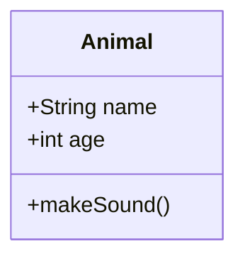

---

## 定义类

### 方式1: 大括号定义

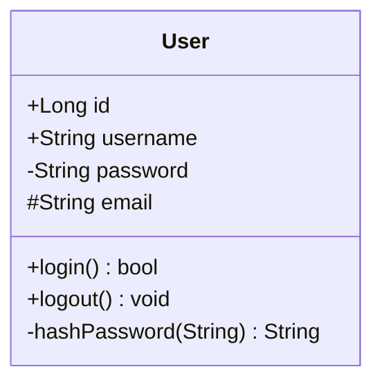

### 方式2: 冒号定义 (单行)

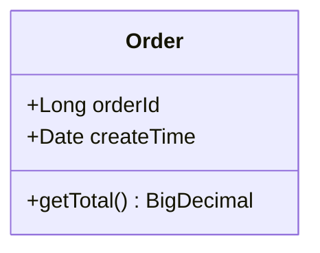

---

## 可见性修饰符

| 符号 | 含义 | Java等价 |
|------|------|----------|
| `+` | public | public |
| `-` | private | private |
| `#` | protected | protected |
| `~` | package/internal | default |

### 示例

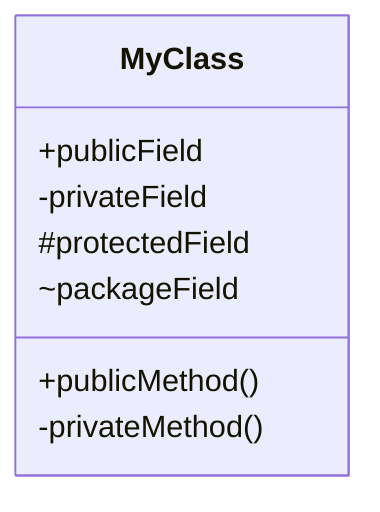

---

## 方法修饰符

| 符号 | 含义 | 位置 |
|------|------|------|
| `*` | 抽象方法 | 方法末尾 |
| `$` | 静态方法/字段 | 方法/字段末尾 |

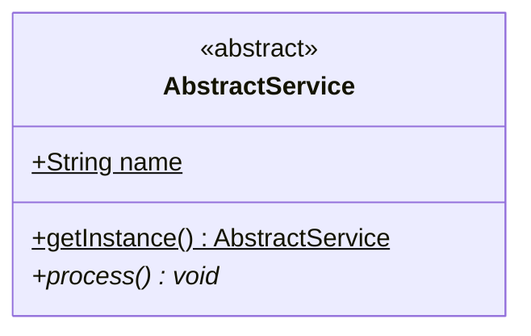

---

## 类关系

### 关系类型速查表

| 语法 | 名称 | 说明 | 示例 |
|------|------|------|------|
| `<\|--` | 继承 Inheritance | 子类继承父类 | Dog继承Animal |
| `*--` | 组合 Composition | 强关联,整体销毁部分也销毁 | Car包含Engine |
| `o--` | 聚合 Aggregation | 弱关联,整体与部分独立 | Team包含Player |
| `-->` | 关联 Association | 普通关联 | Student关联Course |
| `--` | 链接 Link | 实线连接 | - |
| `..>` | 依赖 Dependency | 使用关系 | Client依赖Service |
| `..\|>` | 实现 Realization | 实现接口 | UserService实现IService |
| `..` | 虚线链接 | 虚线连接 | - |

### 关系示例

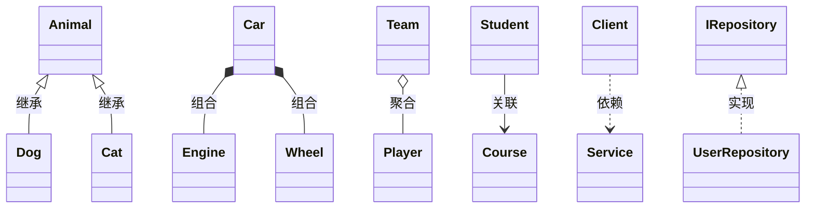

---

## 关系标签和基数

### 关系标签

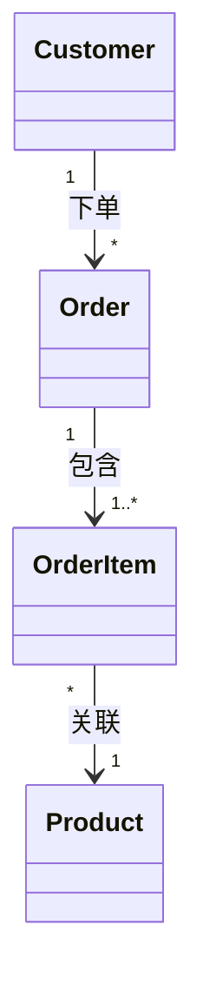

### 基数 (多重性)

| 符号 | 含义 |
|------|------|
| `1` | 恰好一个 |
| `0..1` | 零个或一个 |
| `1..*` | 一个或多个 |
| `*` | 零个或多个 |
| `n` | n个 |
| `0..n` | 零到n个 |
| `1..n` | 一到n个 |

---

## 注解 Annotation

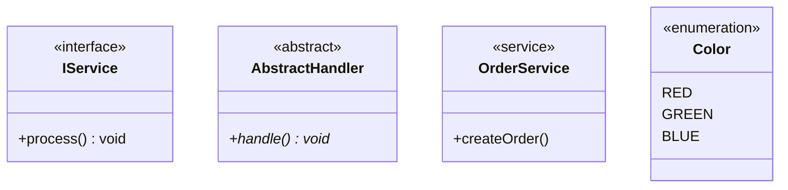

### 常用注解

| 注解 | 用途 |
|------|------|
| `<<interface>>` | 接口 |
| `<<abstract>>` | 抽象类 |
| `<<service>>` | 服务类 |
| `<<enumeration>>` | 枚举 |
| `<<entity>>` | 实体类 |

---

## 泛型

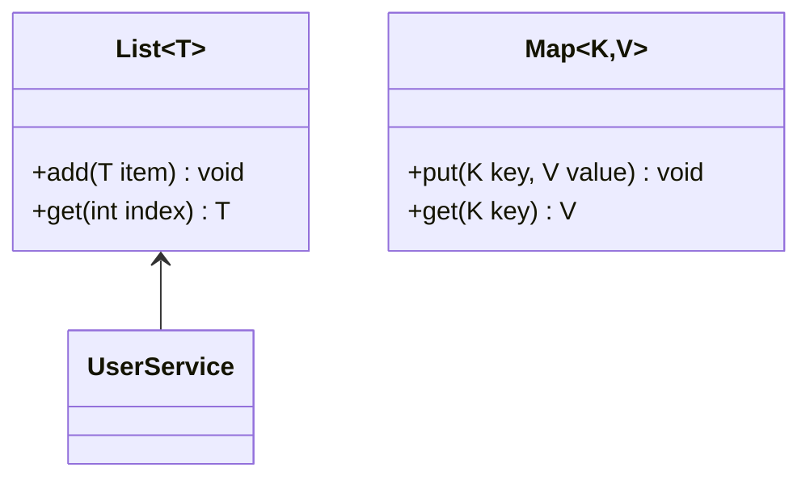

> 注意: 使用 `~T~` 代替 `<T>`

---

## 命名空间 Namespace

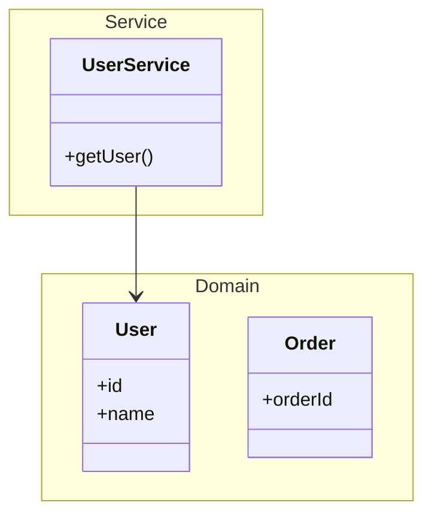

---

## Note 注释 ⭐

### 为类添加注释

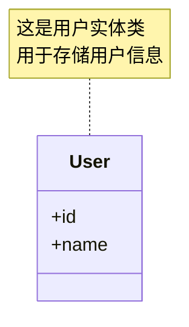

### 通用注释

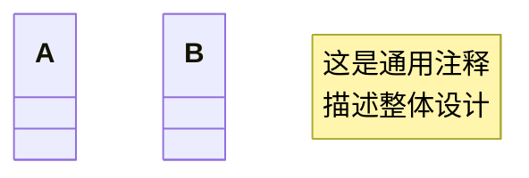

---

## 样式与颜色 ⭐

### style 直接样式

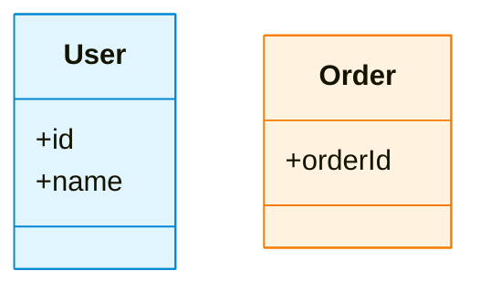

### classDef 类定义

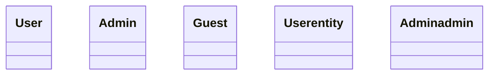

---

## 设置方向

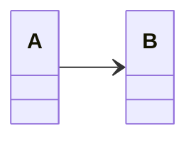

| 方向 | 说明 |
|------|------|
| `TB` | 从上到下 (默认) |
| `BT` | 从下到上 |
| `LR` | 从左到右 |
| `RL` | 从右到左 |

---

## 完整示例

### 电商系统类图

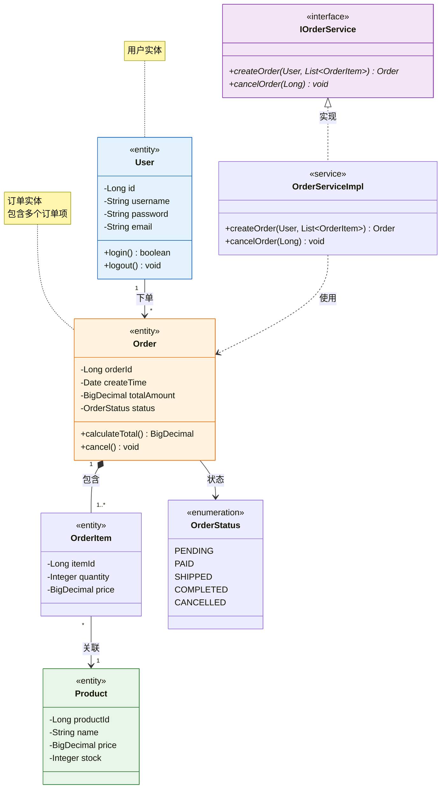

---

## 常见错误

1. **泛型使用波浪号**: `List~T~` 而不是 `List<T>`

2. **关系箭头方向**: 箭头指向被依赖方
   ```text
   Client --> Service  # Client 依赖 Service
   ```

3. **成员定义缩进**: 大括号内的成员需要正确缩进

4. **特殊字符转义**: 类名和方法名避免特殊字符

5. **note 语法**: 使用 `note for 类名 "内容"` 格式
