# Entity Relationship Diagram (ER图)

## 概述

| 属性 | 值 |
|------|-----|
| **关键字** | `erDiagram` |
| **用途** | 数据库设计、实体关系、表结构设计 |
| **Note 支持** | ❌ 不支持 |
| **颜色支持** | ✅ `style` 样式 |
| **状态** | ⚠️ experimental (实验性) |

---

## 基础语法

### 声明方式

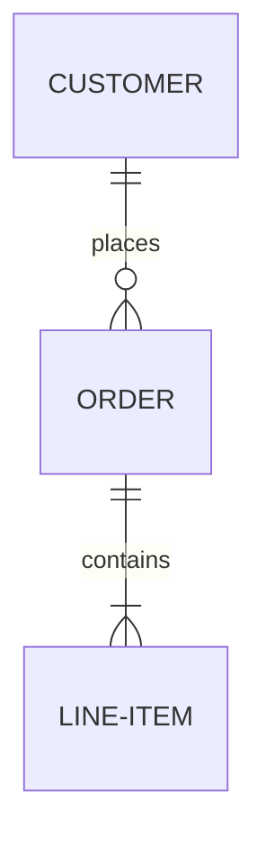

---

## 实体定义

### 简单实体


### 带属性的实体

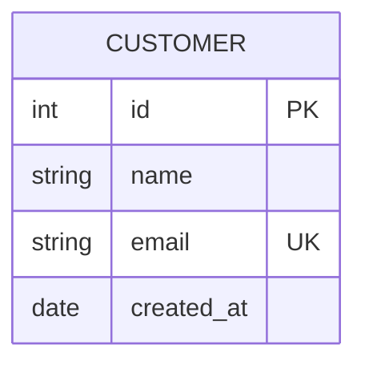

### 实体别名

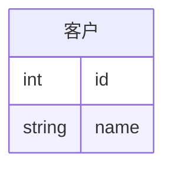

---

## 属性定义

### 属性语法

```text
类型 名称 [PK | FK | UK] ["注释"]
```

### 属性约束

| 约束 | 含义 |
|------|------|
| `PK` | 主键 Primary Key |
| `FK` | 外键 Foreign Key |
| `UK` | 唯一键 Unique Key |

### 属性示例

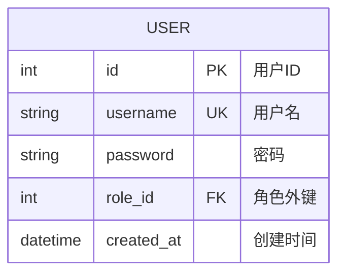

### 常用数据类型

| 类型 | 说明 |
|------|------|
| `int` / `integer` | 整数 |
| `string` / `varchar` | 字符串 |
| `text` | 长文本 |
| `date` | 日期 |
| `datetime` | 日期时间 |
| `boolean` | 布尔值 |
| `float` / `decimal` | 小数 |

---

## 关系定义

### 关系语法

```text
实体1 [关系符号] 实体2 : "标签"
```

### 关系符号

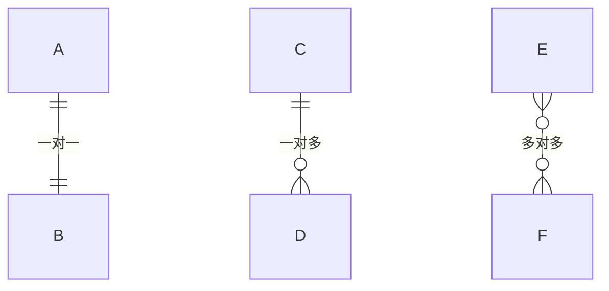

### 关系符号速查表

| 左侧 | 右侧 | 含义 |
|------|------|------|
| `\|o` | `o\|` | 零或一 |
| `\|\|` | `\|\|` | 恰好一个 |
| `}o` | `o{` | 零或多个 |
| `}\|` | `\|{` | 一个或多个 |

### 关系线类型

| 符号 | 说明 |
|------|------|
| `--` | 实线 (标识关系) |
| `..` | 虚线 (非标识关系) |

### 完整关系示例

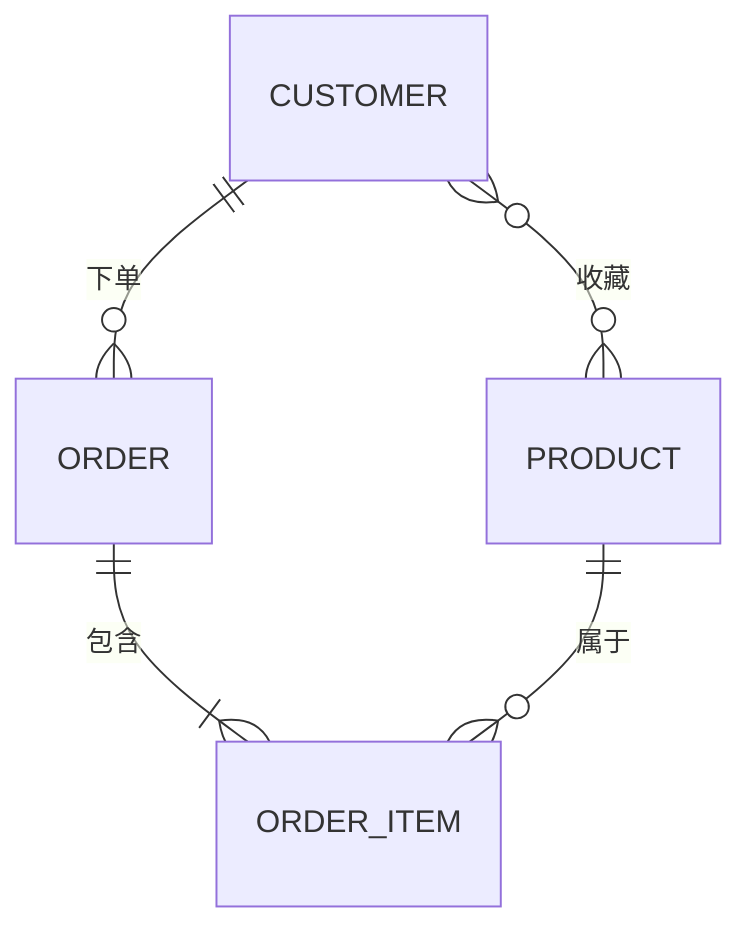

---

## 关系基数详解

### 一对一 (1:1)

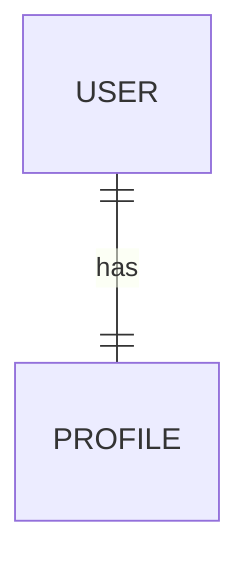

### 一对多 (1:N)


### 多对多 (M:N)


### 零或一

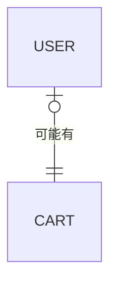

---

## 样式与颜色 ⭐

### style 直接样式

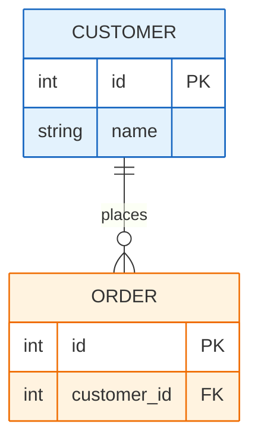

---

## 设置方向

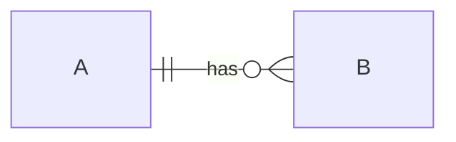

| 方向 | 说明 |
|------|------|
| `TB` | 从上到下 (默认) |
| `BT` | 从下到上 |
| `LR` | 从左到右 |
| `RL` | 从右到左 |

---

## 完整示例

### 电商系统数据模型

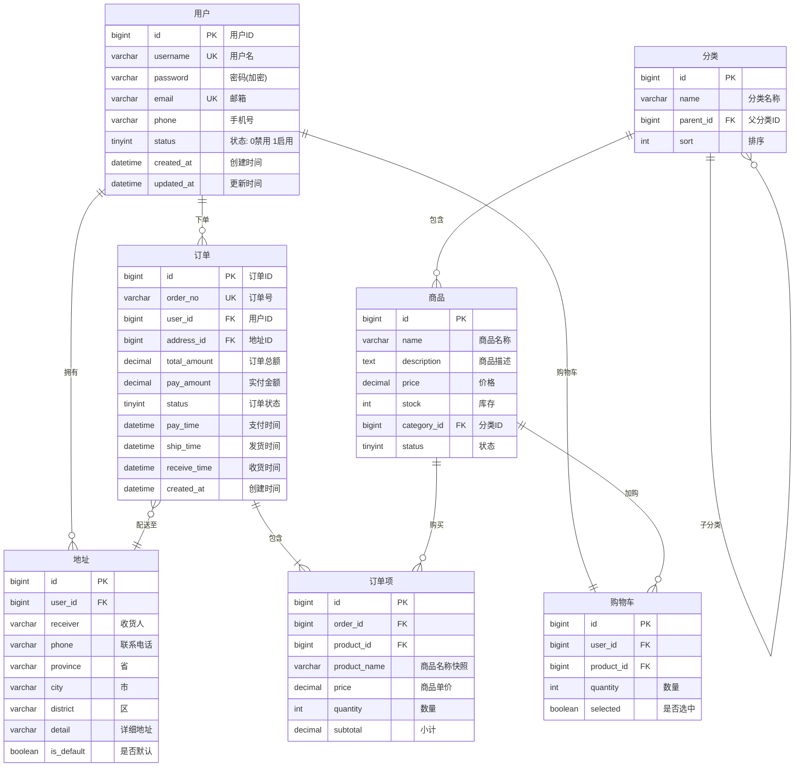

### 博客系统

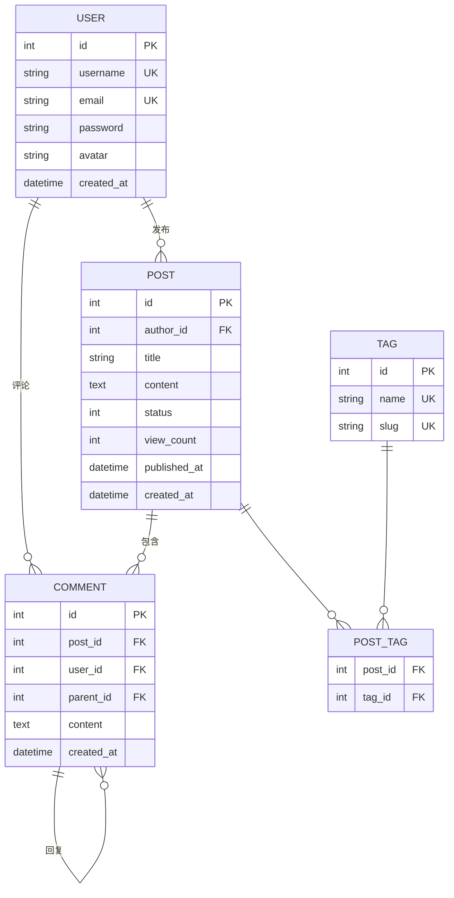

---

## 常见错误

1. **实体名全大写**: 约定使用大写
   ```text
   ✅ CUSTOMER
   ⚠️ Customer  # 可以但不推荐
   ```

2. **关系标签必须有**: 冒号后需要标签（可以是空字符串）
   ```text
   ✅ A ||--o{ B : "包含"
   ✅ A ||--o{ B : ""
   ❌ A ||--o{ B
   ```

3. **属性类型不能有空格**:
   ```text
   ✅ varchar name
   ❌ var char name
   ```

4. **关系符号配对**:
   - 左侧用 `||`, `}|`, `}o`, `|o`
   - 右侧用 `||`, `|{`, `o{`, `o|`

5. **实体名中避免特殊字符**: 使用下划线
   ```text
   ✅ ORDER_ITEM
   ❌ ORDER-ITEM  # 连字符可能有问题
   ```
