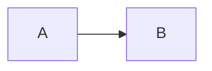
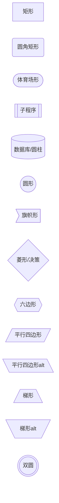
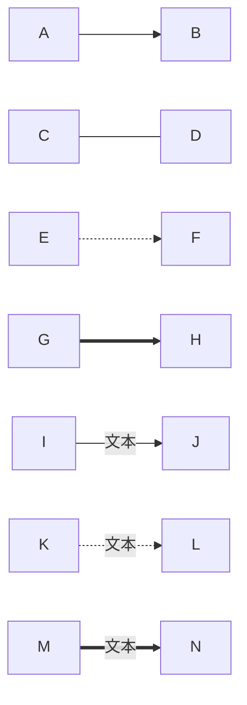
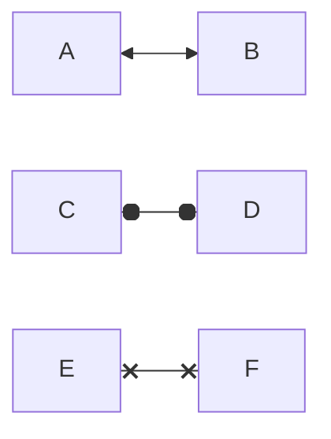
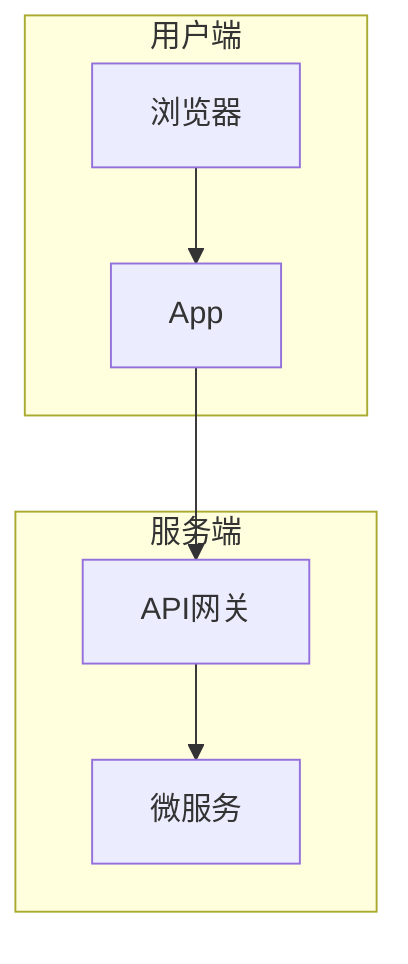
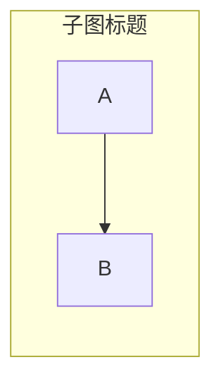
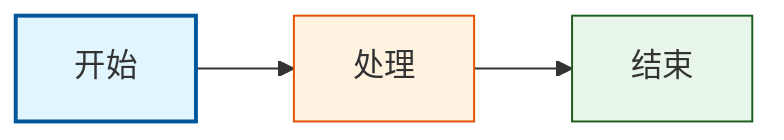
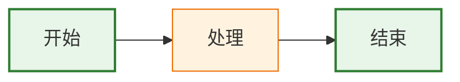
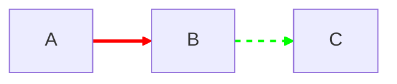
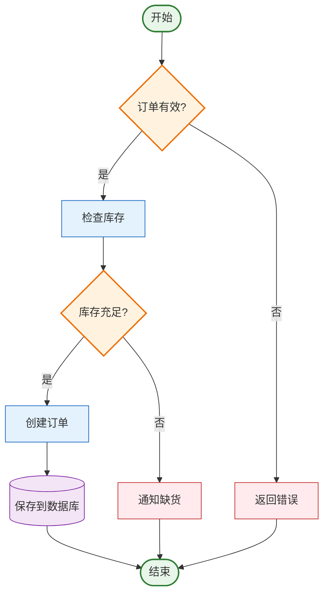

# Flowchart 流程图

## 概述

| 属性 | 值 |
|------|-----|
| **关键字** | `flowchart` 或 `graph` |
| **用途** | 流程、决策树、工作流、系统架构 |
| **Note 支持** | ❌ 不支持（可用特殊节点模拟） |
| **颜色支持** | ✅ `classDef` + `style` |

---

## 基础语法

### 声明方式



### 方向

| 方向 | 含义 |
|------|------|
| `TB` / `TD` | 从上到下 (Top to Bottom / Top-Down) |
| `BT` | 从下到上 (Bottom to Top) |
| `LR` | 从左到右 (Left to Right) |
| `RL` | 从右到左 (Right to Left) |

---

## 节点形状



### 节点形状速查表

| 语法 | 形状 | 用途 |
|------|------|------|
| `A[文本]` | 矩形 | 普通步骤 |
| `A(文本)` | 圆角矩形 | 普通步骤 |
| `A([文本])` | 体育场形 | 开始/结束 |
| `A[[文本]]` | 子程序形 | 子流程 |
| `A[(文本)]` | 圆柱形 | 数据库 |
| `A((文本))` | 圆形 | 开始/结束 |
| `A>文本]` | 旗帜形 | 特殊标记 |
| `A{文本}` | 菱形 | 决策/判断 |
| `A{{文本}}` | 六边形 | 条件准备 |
| `A[/文本/]` | 平行四边形 | 输入/输出 |
| `A[\文本\]` | 平行四边形(反) | 输入/输出 |
| `A[/文本\]` | 梯形 | 手动操作 |
| `A[\文本/]` | 梯形(反) | 优先操作 |
| `A(((文本)))` | 双圆形 | 结束点 |

---

## 连接线/箭头

### 箭头类型



### 连接线速查表

| 语法 | 说明 |
|------|------|
| `-->` | 带箭头实线 |
| `---` | 无箭头实线 |
| `-.->` | 带箭头虚线 |
| `-.-` | 无箭头虚线 |
| `==>` | 带箭头粗线 |
| `===` | 无箭头粗线 |
| `--文本-->` | 带文本箭头 |
| `-- 文本 ---` | 带文本无箭头 |
| `-.文本.->` | 虚线带文本 |
| `==文本==>` | 粗线带文本 |
| `~~~` | 不可见连接（用于布局） |

### 双向箭头



---

## 子图 Subgraph



### 子图语法

```text
subgraph 标题
    节点定义...
end
```

### 子图方向



---

## 样式与颜色

### 方式1: style 直接样式



**style 语法**:
```text
style 节点ID fill:颜色,stroke:边框色,stroke-width:边框宽,color:文字色
```

### 方式2: classDef 类定义



**classDef 语法**:
```text
classDef 类名 fill:颜色,stroke:边框色,stroke-width:边框宽,color:文字色
```

**应用类的两种方式**:
```text
%% 方式1: 声明时使用 :::
A[文本]:::类名

%% 方式2: 单独声明
class A,B,C 类名
```

### 连接线样式



**linkStyle 语法**:
```text
linkStyle 索引 stroke:颜色,stroke-width:宽度
```
> 注意: 索引从 0 开始，按连接线出现顺序计数

---

## 完整示例

### 订单处理流程



---

## 常见错误

1. **特殊字符需转义**: 使用 `"` 包含特殊字符
   ```mermaid
   flowchart LR
       A["包含(括号)的文本"]
   ```

2. **节点ID不能有空格**: 使用驼峰或下划线
   ```text
   ❌ my node[文本]
   ✅ myNode[文本]
   ✅ my_node[文本]
   ```

3. **子图标题不能为空**: subgraph 后必须有标题

4. **linkStyle索引从0开始**: 第一条连接线是索引0
