# Gantt Chart 甘特图

## 概述

| 属性 | 值 |
|------|-----|
| **关键字** | `gantt` |
| **用途** | 项目计划、时间线、任务排期、里程碑 |
| **Note 支持** | ❌ 不支持 |
| **颜色支持** | ✅ `crit` / `done` / `active` 标签 + CSS 样式 |

---

## 基础语法

### 声明方式

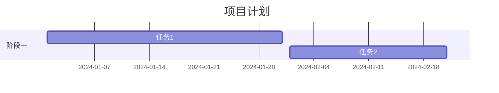

---

## 基本元素

### 标题 title

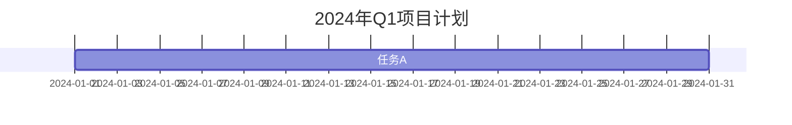

### 日期格式 dateFormat

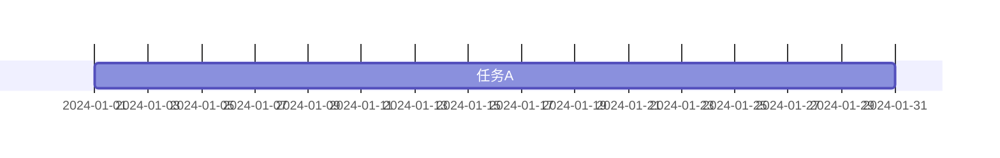

常用日期格式：

| 格式 | 示例 |
|------|------|
| `YYYY-MM-DD` | 2024-01-15 |
| `DD-MM-YYYY` | 15-01-2024 |
| `YYYY-MM-DD HH:mm` | 2024-01-15 14:30 |

### 轴日期格式 axisFormat

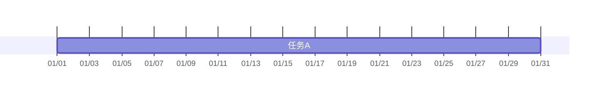

常用轴格式：

| 格式 | 说明 | 示例 |
|------|------|------|
| `%Y-%m-%d` | 年-月-日 | 2024-01-15 |
| `%m/%d` | 月/日 | 01/15 |
| `%d %b` | 日 月缩写 | 15 Jan |
| `%b %Y` | 月缩写 年 | Jan 2024 |
| `%W` | 周数 | 03 |

---

## 分区 Section

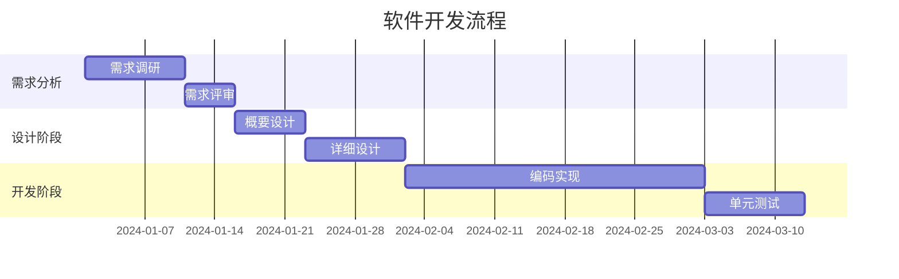

---

## 任务定义

### 任务语法

```text
任务名称 : [标签], [任务ID], [开始时间], [持续时间或结束时间]
```

### 基本任务

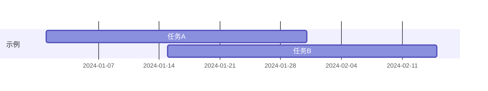

### 带ID的任务

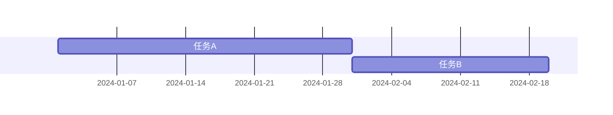

### 任务依赖 after

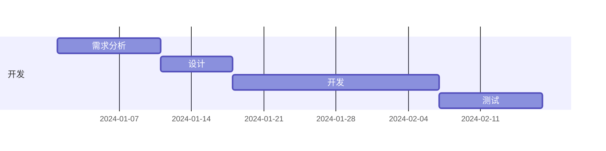

### 多任务依赖

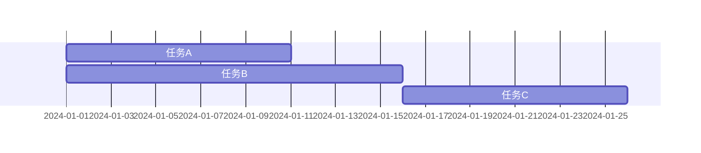

---

## 任务状态标签 ⭐

### done - 已完成

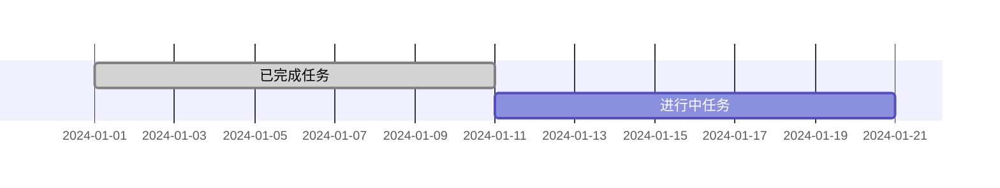

### active - 进行中

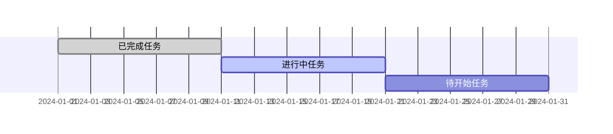

### crit - 关键路径

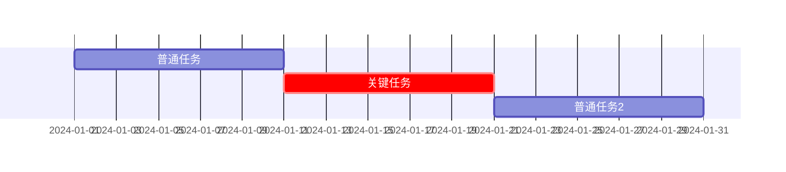

### 组合标签

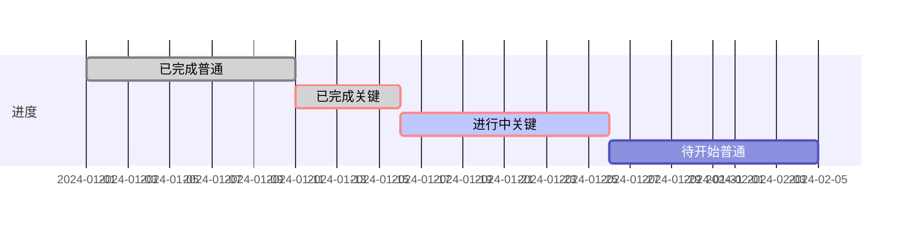

---

## 里程碑 Milestone

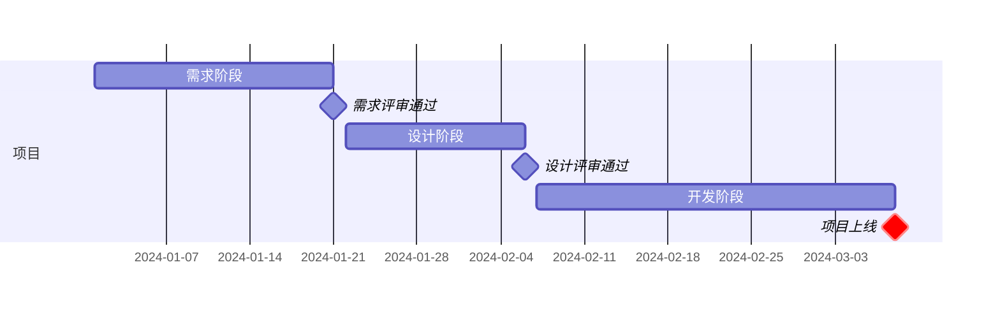

### 里程碑语法

```text
里程碑名称 : milestone, [crit], 日期, 0d
```

---

## 垂直标记 Vertical Markers (v11.3.0+)

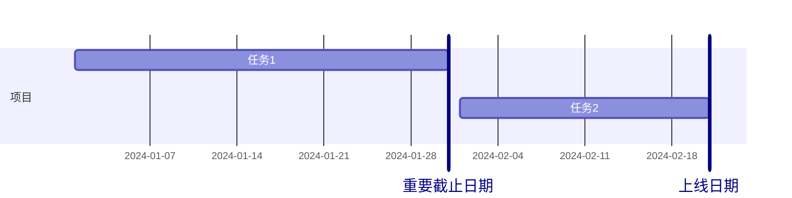

---

## 排除日期 Excludes

### 排除周末

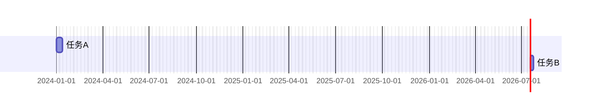

### 排除特定日期

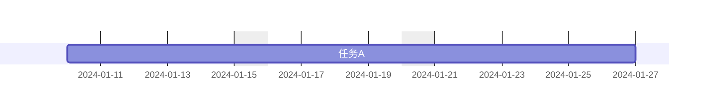

### 排除星期几

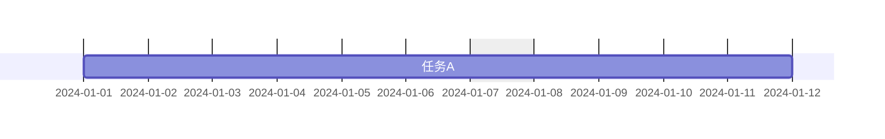

---

## Today 标记


### 关闭 Today 标记

```text
todayMarker off
```

---

## 紧凑模式

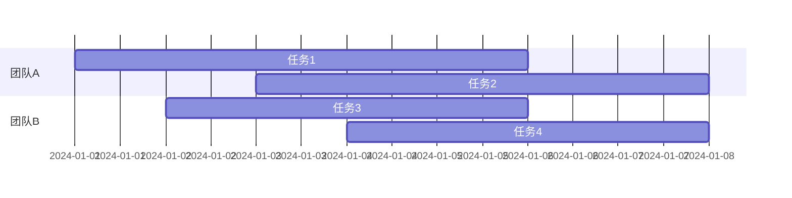

---

## 完整示例

### 软件项目计划

```mermaid
gantt
    title 电商平台重构项目
    dateFormat YYYY-MM-DD
    axisFormat %m/%d
    excludes weekends
    
    section 需求阶段
    需求调研         : done, req1, 2024-01-02, 10d
    需求分析         : done, req2, after req1, 5d
    需求评审         : done, milestone, m1, after req2, 0d
    
    section 设计阶段
    架构设计         : done, design1, after m1, 7d
    数据库设计       : done, design2, after m1, 5d
    接口设计         : done, design3, after design2, 5d
    设计评审通过     : milestone, m2, after design1 design3, 0d
    
    section 开发阶段
    用户模块开发     : active, crit, dev1, after m2, 15d
    订单模块开发     : active, crit, dev2, after m2, 20d
    支付模块开发     : dev3, after dev1, 10d
    后台管理开发     : dev4, after m2, 25d
    开发完成         : milestone, crit, m3, after dev2 dev3 dev4, 0d
    
    section 测试阶段
    单元测试         : test1, after dev1, 5d
    集成测试         : crit, test2, after m3, 10d
    性能测试         : test3, after test2, 5d
    UAT测试          : crit, test4, after test3, 7d
    测试通过         : milestone, crit, m4, after test4, 0d
    
    section 上线阶段
    生产环境部署     : crit, deploy, after m4, 2d
    数据迁移         : crit, migrate, after deploy, 1d
    正式上线         : milestone, crit, after migrate, 0d
```

### 迭代开发计划

```mermaid
gantt
    title Sprint计划
    dateFormat YYYY-MM-DD
    axisFormat %m/%d
    
    section Sprint 1
    用户故事1-1 : done, 2024-01-01, 3d
    用户故事1-2 : done, 2024-01-01, 4d
    用户故事1-3 : done, 2024-01-04, 3d
    Sprint 1评审 : milestone, done, 2024-01-07, 0d
    
    section Sprint 2
    用户故事2-1 : active, crit, 2024-01-08, 4d
    用户故事2-2 : active, 2024-01-08, 5d
    用户故事2-3 : 2024-01-12, 3d
    Sprint 2评审 : milestone, 2024-01-15, 0d
    
    section Sprint 3
    用户故事3-1 : 2024-01-16, 5d
    用户故事3-2 : 2024-01-16, 4d
    用户故事3-3 : 2024-01-20, 3d
    Sprint 3评审 : milestone, 2024-01-23, 0d
    
    section 发布
    版本发布 : milestone, crit, 2024-01-24, 0d
```

---

## 常见错误

1. **日期格式必须匹配 dateFormat**:
   ```text
   dateFormat YYYY-MM-DD
   ✅ 任务 : 2024-01-01, 10d
   ❌ 任务 : 01/01/2024, 10d
   ```

2. **任务ID不能有空格**:
   ```text
   ✅ 任务 : taskA, 2024-01-01, 10d
   ❌ 任务 : task A, 2024-01-01, 10d
   ```

3. **标签顺序**: 状态标签必须在前
   ```text
   ✅ 任务 : done, crit, taskA, 2024-01-01, 10d
   ❌ 任务 : taskA, done, crit, 2024-01-01, 10d
   ```

4. **after 引用的任务ID必须存在**:
   ```text
   任务A : a, 2024-01-01, 10d
   任务B : after a, 5d  # 正确引用
   ```

5. **里程碑持续时间**: 里程碑应使用 `0d`
   ```text
   里程碑 : milestone, 2024-01-15, 0d
   ```

6. **Section 名称不能为空**: section 后必须有名称

7. **持续时间不支持小数**: Mermaid 不支持小数天数，需要向上取整，并在任务名称中标注实际时长
   ```text
   ❌ 任务 : 2024-01-01, 1.5d  # 语法错误
   ✅ 任务（实际1.5d） : 2024-01-01, 2d  # 在名称中标注实际时长
   ```

   **最佳实践**: 将实际工作量写在任务名称中
   ```text
   提测（肖倩文）1.5d : active, 2025-12-19, 2d
   后端开发（缪庆军）3d : done, 2025-12-11, 3d
   ```
