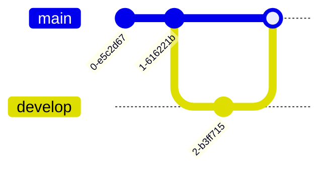
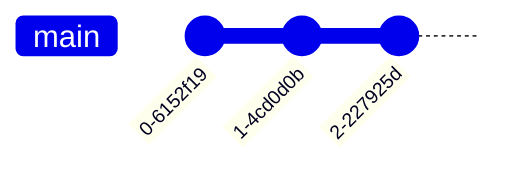
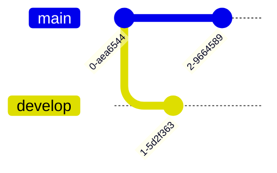
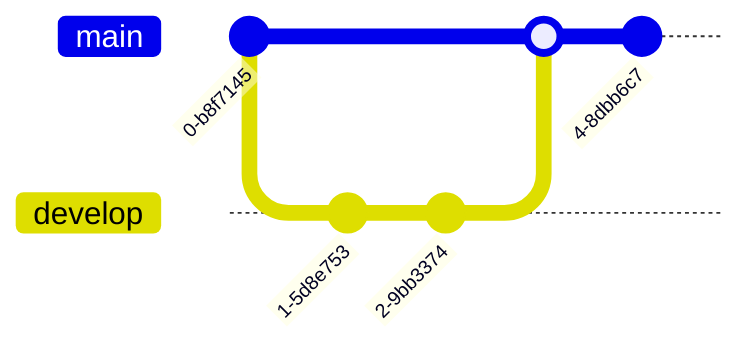
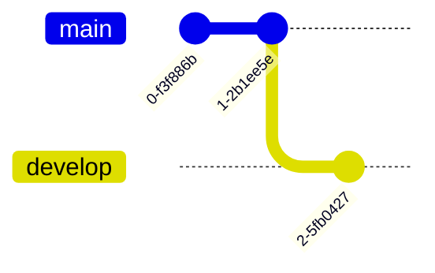
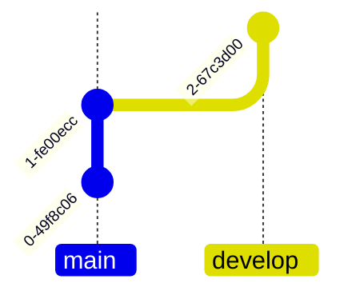
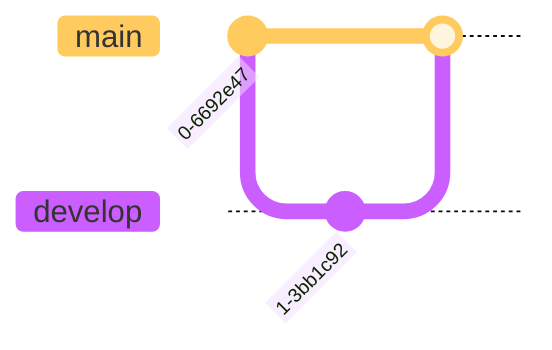
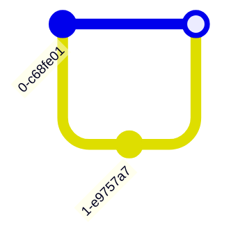
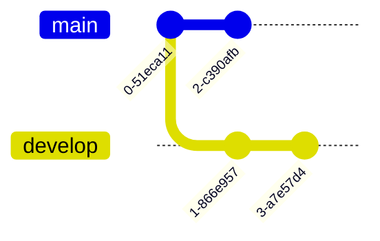

# GitGraph Git分支图

## 概述

| 属性 | 值 |
|------|-----|
| **关键字** | `gitGraph` |
| **用途** | Git分支策略、版本控制可视化、代码合并流程 |
| **Note 支持** | ❌ 不支持 |
| **颜色支持** | ✅ Theme 变量自定义分支颜色 |

---

## 基础语法

### 声明方式



---

## 基本操作

### commit 提交



### 带消息的提交


### 带类型的提交


**提交类型**:

| 类型 | 说明 |
|------|------|
| `NORMAL` | 普通提交 (默认) |
| `HIGHLIGHT` | 高亮提交 |
| `REVERSE` | 反转提交 |

### 带标签的提交


---

## 分支操作

### branch 创建分支


### checkout 切换分支



### merge 合并分支



### 带标签的合并


---

## cherry-pick


---

## 方向设置

### 左到右 (默认)



### 从上到下


### 从下到上 (v11.0.0+)



---

## 主题与颜色 ⭐

### 使用主题



**可用主题**: `default`, `forest`, `dark`, `neutral`, `base`

### 自定义分支颜色


### 颜色变量

| 变量 | 说明 |
|------|------|
| `git0` | 第一个分支 (通常是main) |
| `git1` | 第二个分支 |
| `git2` | 第三个分支 |
| `git3` - `git7` | 后续分支 |
| `gitBranchLabel0` - `gitBranchLabel7` | 分支标签颜色 |
| `gitInv0` - `gitInv7` | 反转提交颜色 |
| `commitLabelColor` | 提交标签颜色 |
| `commitLabelBackground` | 提交标签背景 |
| `tagLabelColor` | 标签颜色 |
| `tagLabelBackground` | 标签背景 |
| `tagLabelBorder` | 标签边框 |

---

## 配置选项

### 自定义主分支名


### 隐藏分支名



### 隐藏提交标签


### 旋转提交标签


### 并行提交 (v10.8.0+)



---

## 完整示例

### Git Flow 工作流

```mermaid
gitGraph
    commit id: "初始化项目"
    
    branch develop
    checkout develop
    commit id: "开发环境配置"
    
    branch feature/login
    checkout feature/login
    commit id: "登录页面"
    commit id: "登录逻辑"
    commit id: "登录测试"
    
    checkout develop
    merge feature/login tag: "feature complete"
    
    branch feature/order
    checkout feature/order
    commit id: "订单页面"
    commit id: "订单逻辑"
    
    checkout develop
    merge feature/order
    
    checkout main
    merge develop tag: "v1.0.0"
    
    branch hotfix/security
    checkout hotfix/security
    commit id: "安全修复" type: HIGHLIGHT
    
    checkout main
    merge hotfix/security tag: "v1.0.1"
    
    checkout develop
    merge hotfix/security
```

### 简化发布流程

```mermaid
%%{init: { 'theme': 'base', 'themeVariables': {
    'git0': '#2196F3',
    'git1': '#4CAF50',
    'git2': '#FF9800'
}}}%%
gitGraph
    commit id: "v1.0.0" tag: "v1.0.0"
    
    branch release/1.1
    checkout release/1.1
    commit id: "准备1.1发布"
    commit id: "版本号更新"
    
    checkout main
    merge release/1.1 tag: "v1.1.0"
    
    branch release/1.2
    checkout release/1.2
    commit id: "准备1.2发布"
    
    checkout main
    commit id: "紧急修复" type: HIGHLIGHT
    commit tag: "v1.1.1"
    
    checkout release/1.2
    cherry-pick id: "紧急修复"
    commit id: "1.2功能完成"
    
    checkout main
    merge release/1.2 tag: "v1.2.0"
```

### 功能分支开发

```mermaid
gitGraph TB:
    commit id: "main"
    
    branch feature-A
    commit id: "A-1"
    commit id: "A-2"
    
    checkout main
    branch feature-B
    commit id: "B-1"
    commit id: "B-2"
    commit id: "B-3"
    
    checkout main
    merge feature-A id: "Merge A" tag: "A完成"
    merge feature-B id: "Merge B" tag: "B完成"
    
    commit id: "Release" type: HIGHLIGHT tag: "v2.0"
```

---

## 常见错误

1. **checkout 必须在已存在的分支**:
   ```text
   ✅ branch develop
      checkout develop
   ❌ checkout develop  # 分支未创建
   ```

2. **merge 需要在目标分支上**:
   ```text
   ✅ checkout main
      merge develop  # 将develop合并到main
   ```

3. **cherry-pick 需要引用已存在的commit id**:
   ```text
   ✅ commit id: "C"
      cherry-pick id: "C"
   ❌ cherry-pick id: "X"  # ID不存在
   ```

4. **方向设置需要冒号**:
   ```text
   ✅ gitGraph LR:
   ✅ gitGraph TB:
   ❌ gitGraph LR
   ```

5. **tag 必须跟在 commit 或 merge 后**:
   ```text
   ✅ commit tag: "v1.0"
   ✅ merge develop tag: "v1.0"
   ❌ tag: "v1.0"  # 独立使用
   ```

6. **提交类型大写**:
   ```text
   ✅ commit type: HIGHLIGHT
   ❌ commit type: highlight
   ```
