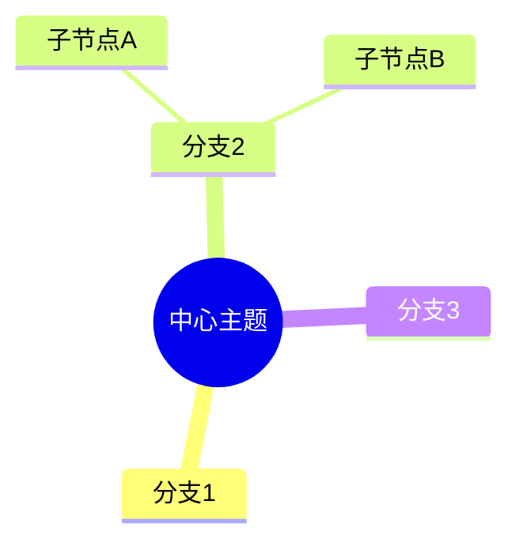
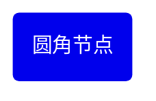
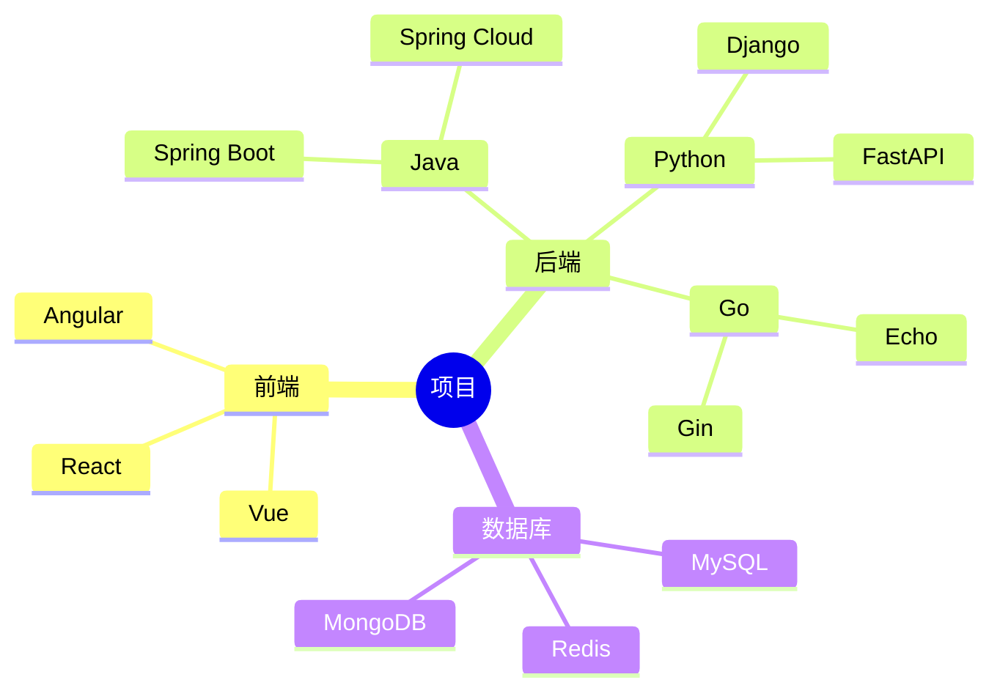
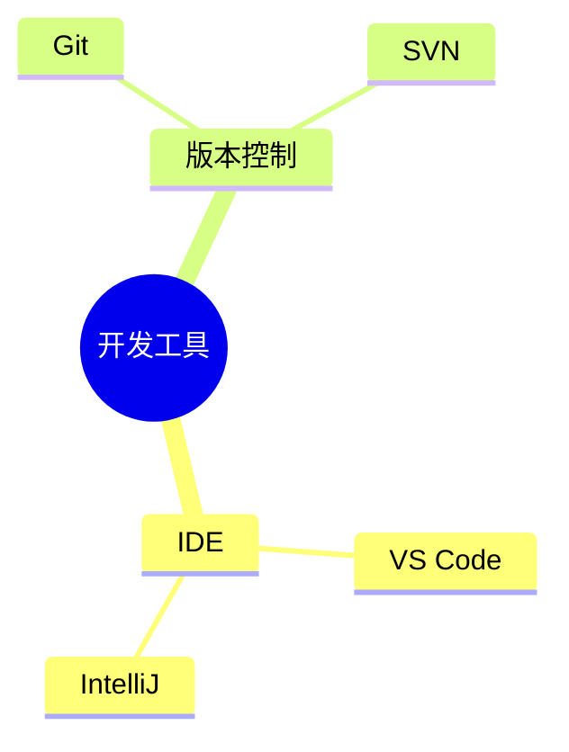
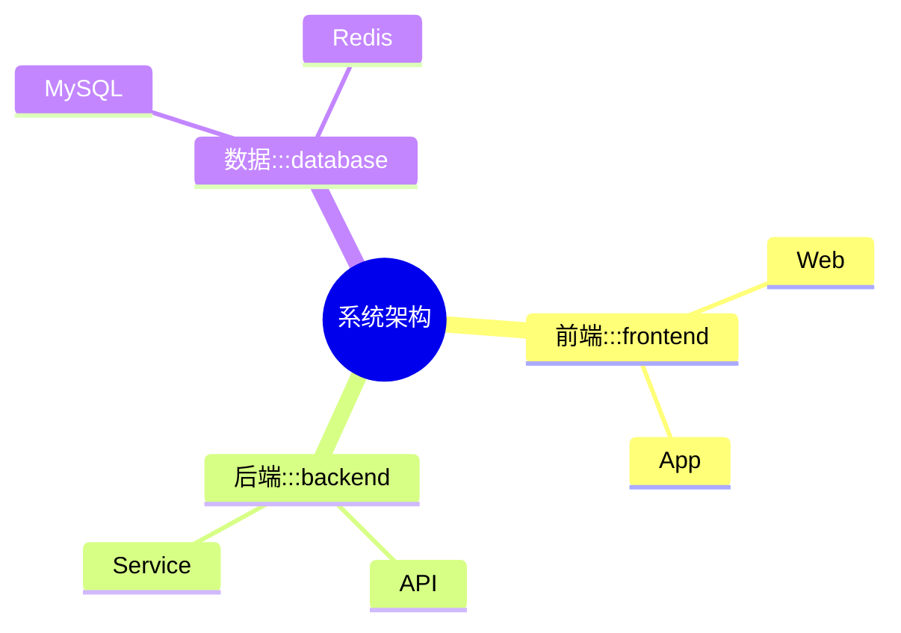
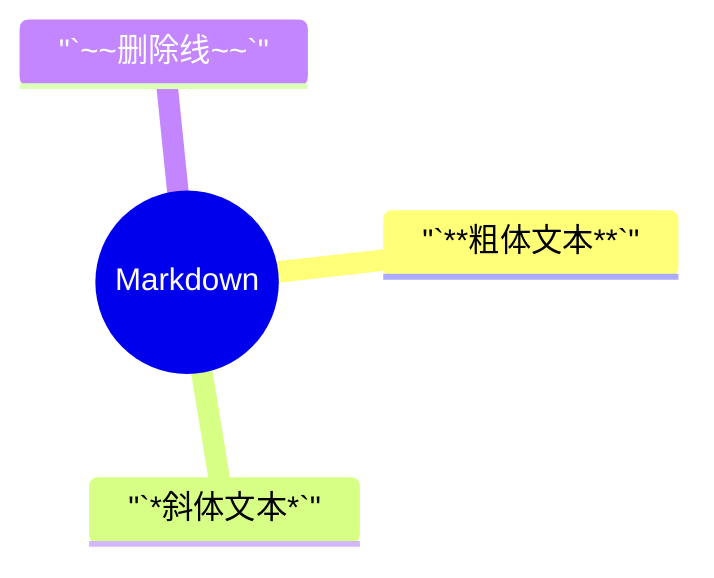
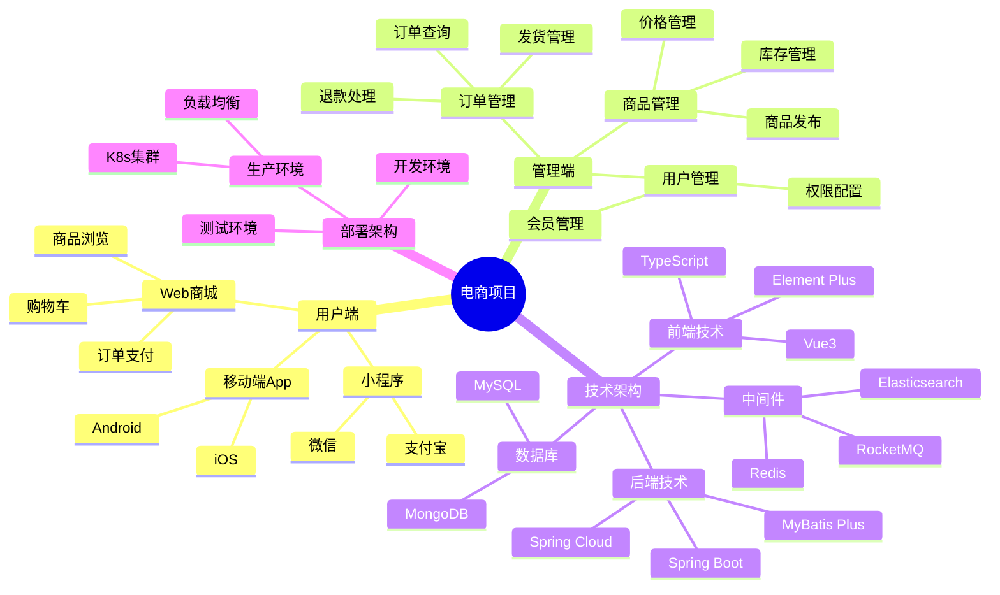
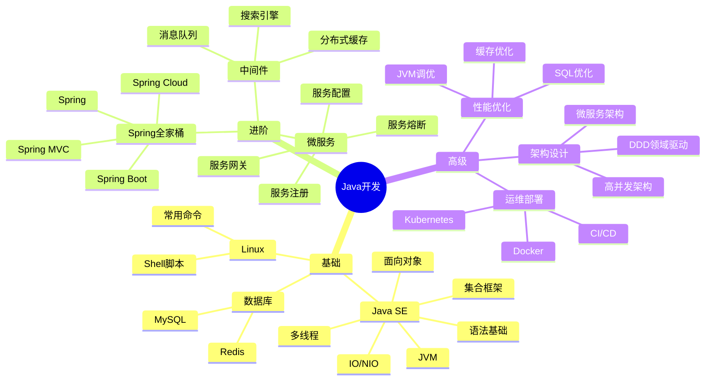
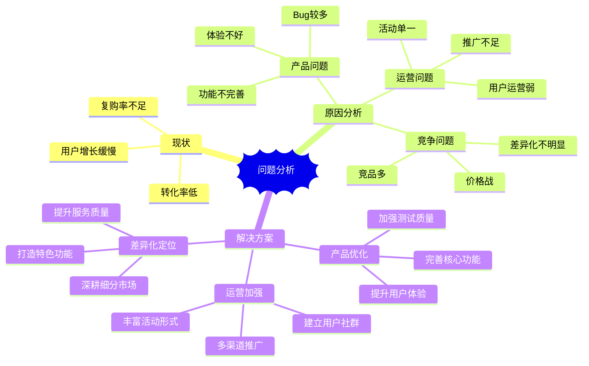

# Mindmap 思维导图

## 概述

| 属性 | 值 |
|------|-----|
| **关键字** | `mindmap` |
| **用途** | 头脑风暴、知识结构、概念梳理、分类整理 |
| **Note 支持** | ❌ 不支持 |
| **颜色支持** | ✅ `class` 样式类 |

---

## 基础语法

### 声明方式



**核心规则**: 使用**缩进**表示层级关系

---

## 节点形状

### 默认形状


### 圆形 (根节点常用)


### 圆角矩形



### 方形


### 爆炸形 (强调)


### 云朵形


### 六边形


### 形状速查表

| 语法 | 形状 | 用途 |
|------|------|------|
| `节点` | 默认 | 普通节点 |
| `((节点))` | 圆形 | 根节点/中心 |
| `(节点)` | 圆角矩形 | 主要分支 |
| `[节点]` | 方形 | 普通节点 |
| `))节点((` | 爆炸形 | 强调/重点 |
| `)节点(` | 云朵形 | 想法/概念 |
| `{{节点}}` | 六边形 | 决策/条件 |

---

## 层级结构



> 关键: 使用**一致的缩进** (空格或Tab)

---

## 图标

### 添加图标



### 图标语法

```text
节点名
    ::icon(图标类名)
```

> 支持 Font Awesome 图标

---

## 样式类 ⭐

### 定义和应用类



### 类语法

```text
节点名:::类名
```

---

## Markdown 格式



> 使用 `` ` `` 包裹 Markdown 语法

---

## 完整示例

### 项目知识结构



### 学习路线图



### 会议头脑风暴



---

## 常见错误

1. **缩进必须一致**: 使用相同的空格或Tab
   ```text
   ✅ 使用2空格或4空格缩进
   ❌ 混用空格和Tab
   ```

2. **根节点只能有一个**:
   ```text
   ✅ mindmap
          root
              node1
              node2
   ❌ mindmap
          root1
          root2
   ```

3. **形状符号成对**:
   ```text
   ✅ ((圆形))
   ✅ [方形]
   ❌ ((圆形)
   ❌ [方形
   ```

4. **特殊字符使用引号**:
   ```text
   ✅ "包含(括号)的文本"
   ❌ 包含(括号)的文本
   ```

5. **图标行单独一行**: `::icon()` 要单独放一行
   ```text
   ✅ 节点名
          ::icon(fa fa-star)
   ❌ 节点名 ::icon(fa fa-star)
   ```

6. **避免过深嵌套**: 建议不超过5层
