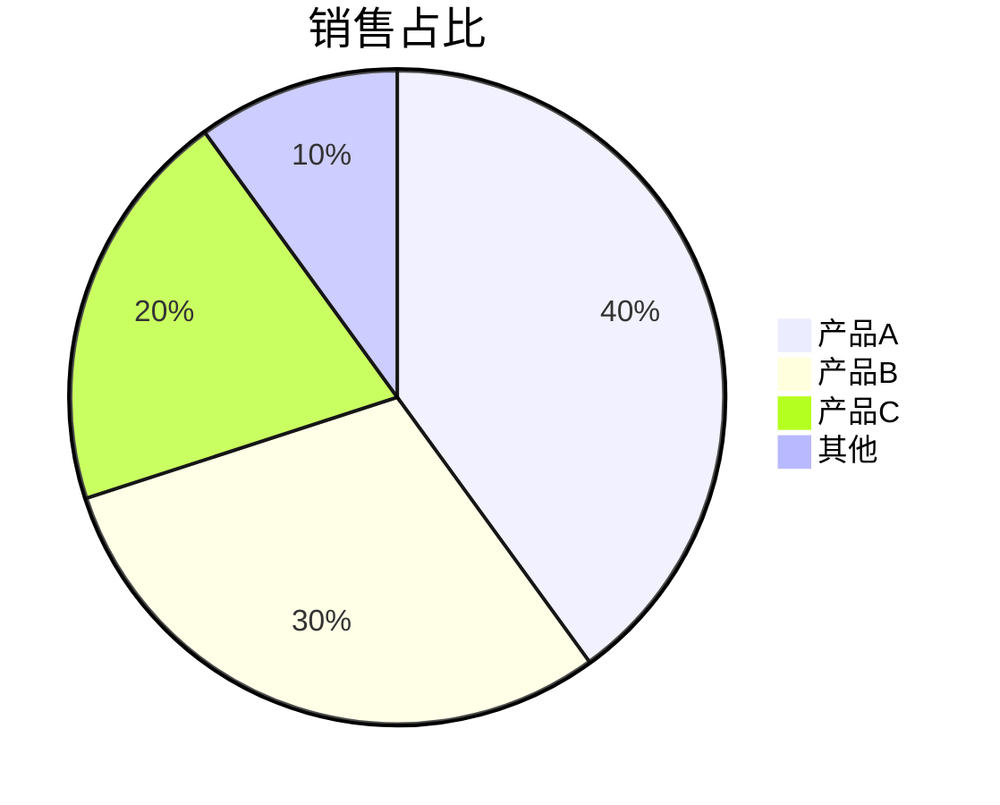
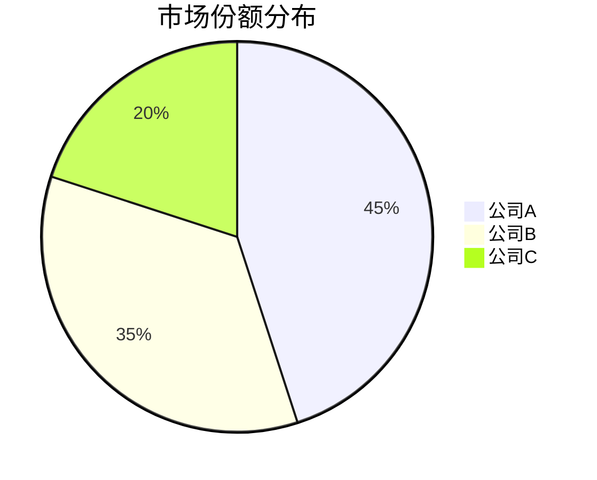
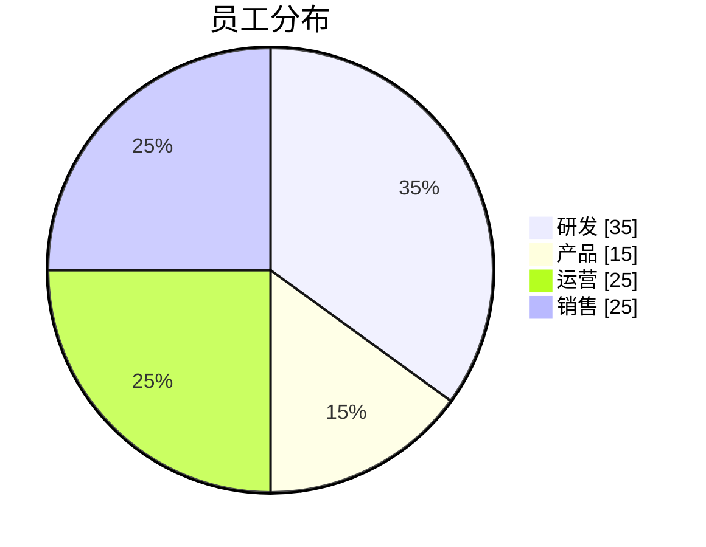
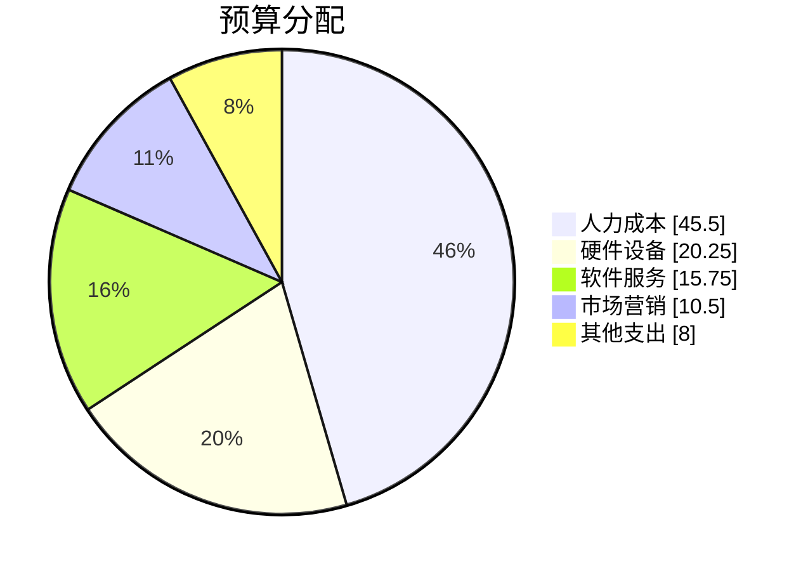
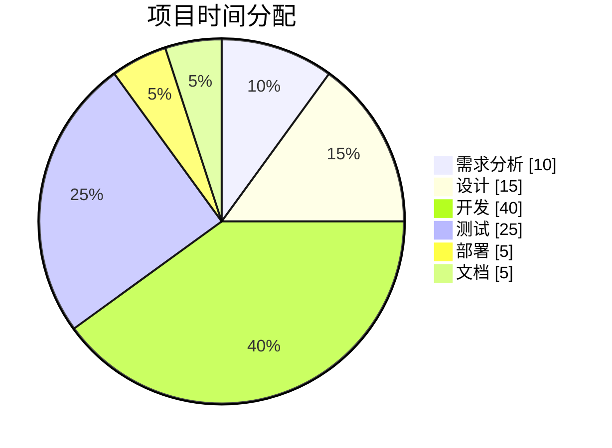
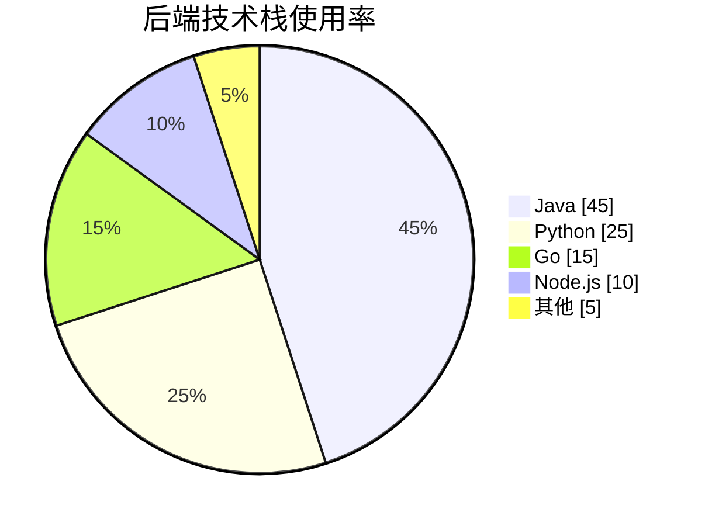
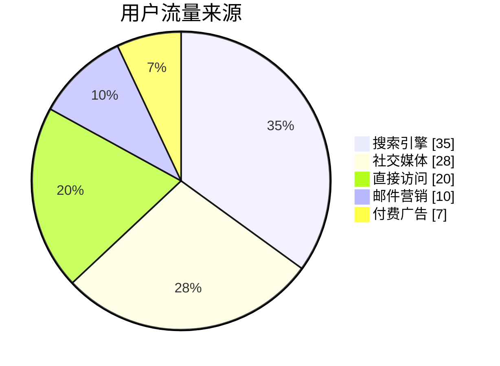
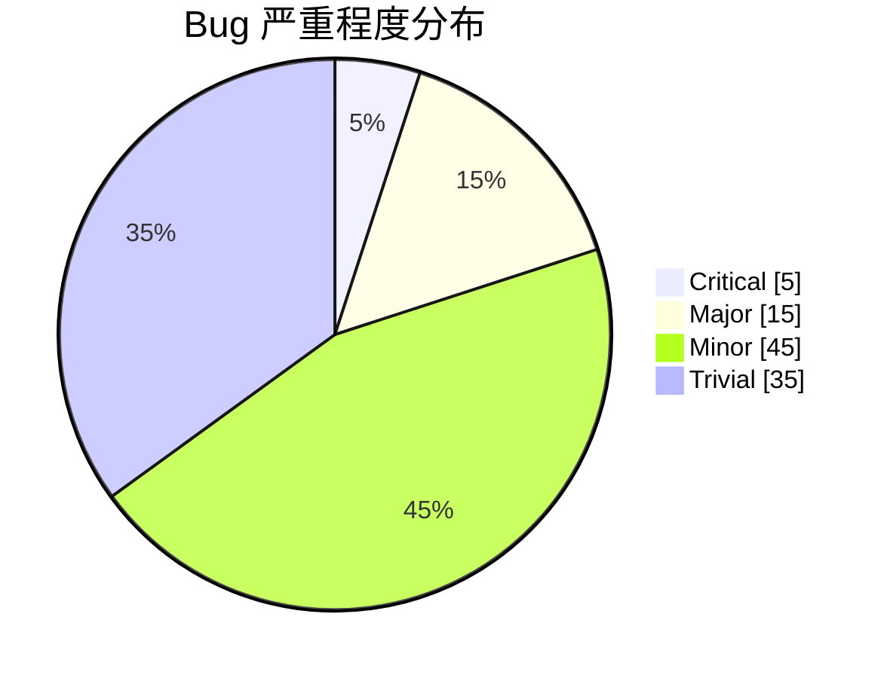
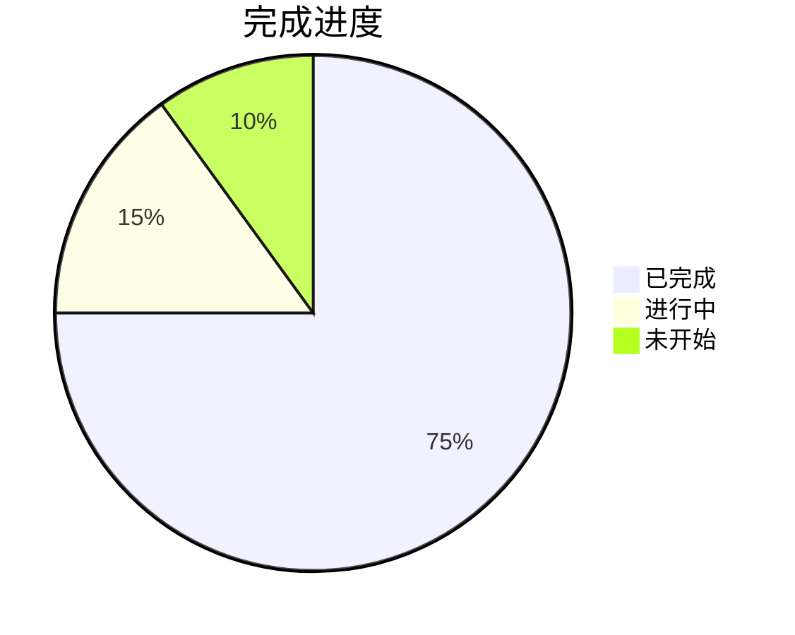

# Pie Chart 饼图

## 概述

| 属性 | 值 |
|------|-----|
| **关键字** | `pie` |
| **用途** | 数据占比、份额分布、比例展示 |
| **Note 支持** | ❌ 不支持 |
| **颜色支持** | ❌ 有限（使用主题颜色） |

---

## 基础语法

### 声明方式



---

## 基本元素

### 标题 title



### 显示数值 showData



> `showData` 会在图例旁显示具体数值

---

## 数据定义

### 数据语法

```text
"标签" : 数值
```

### 数值规则

- 必须是**正数** (> 0)
- 支持最多**两位小数**
- 自动计算百分比

### 示例



---

## 完整示例

### 项目时间分配



### 技术栈分布



### 用户来源分析



### Bug 分类统计



### 简单占比



---

## 配置选项

### textPosition 文字位置

```text
%%{init: {"pie": {"textPosition": 0.5}} }%%
pie
    title 示例
    "A" : 50
    "B" : 50
```

`textPosition` 范围: 0.0 - 1.0 (默认 0.75)
- 0.0: 中心
- 1.0: 边缘

---

## 常见错误

1. **数值必须为正数**:
   ```text
   ✅ "类别" : 25
   ❌ "类别" : -5
   ❌ "类别" : 0
   ```

2. **标签需要引号**:
   ```text
   ✅ "标签名" : 25
   ❌ 标签名 : 25
   ```

3. **冒号两侧建议有空格**:
   ```text
   ✅ "标签" : 25
   ⚠️ "标签":25  # 可能有问题
   ```

4. **showData 位置**: 紧跟在 `pie` 后面
   ```text
   ✅ pie showData
   ❌ pie
      showData
   ```

5. **不支持自定义颜色**: 颜色由主题决定，按顺序分配

6. **标签不能重复**: 每个标签应唯一
   ```text
   ✅ "类别A" : 25
      "类别B" : 25
   ❌ "类别A" : 25
      "类别A" : 25
   ```
