# Sequence Diagram 时序图

## 概述

| 属性 | 值 |
|------|-----|
| **关键字** | `sequenceDiagram` |
| **用途** | API调用、消息传递、系统交互、用例流程 |
| **Note 支持** | ✅ `Note right of` / `Note left of` / `Note over` |
| **颜色支持** | ✅ `rect rgb()` / `rect rgba()` 背景高亮 |

---

## 基础语法

### 声明方式

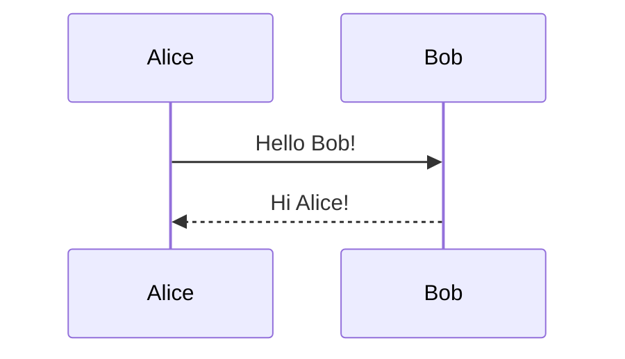
```mermaid
sequenceDiagram
    Alice->>Bob: Hello Bob!
    Bob-->>Alice: Hi Alice!
```

---

## 参与者类型

### participant 和 actor

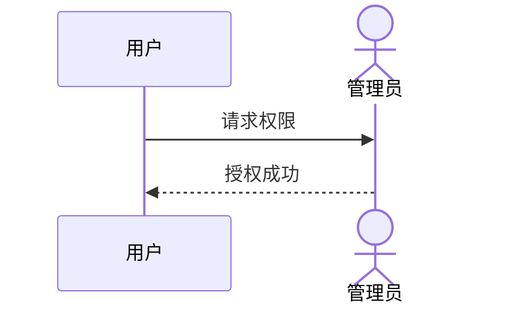
```mermaid
sequenceDiagram
    participant A as 用户
    actor B as 管理员
    A->>B: 请求权限
    B-->>A: 授权成功
```

### 特殊参与者类型 (v10.3.0+)

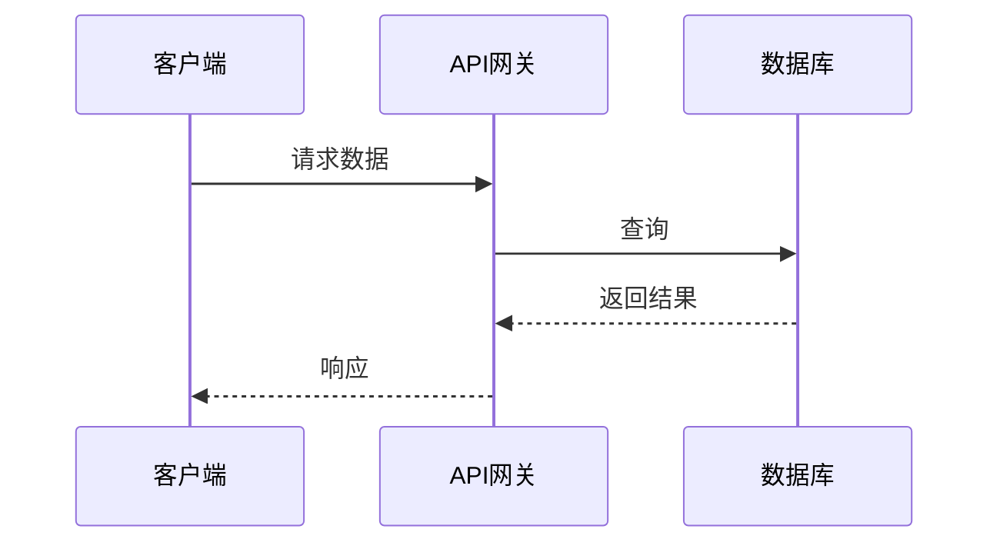
```mermaid
sequenceDiagram
    participant Client as 客户端
    participant API as API网关
    participant DB as 数据库
    
    Client->>API: 请求数据
    API->>DB: 查询
    DB-->>API: 返回结果
    API-->>Client: 响应
```

---

## 消息/箭头类型

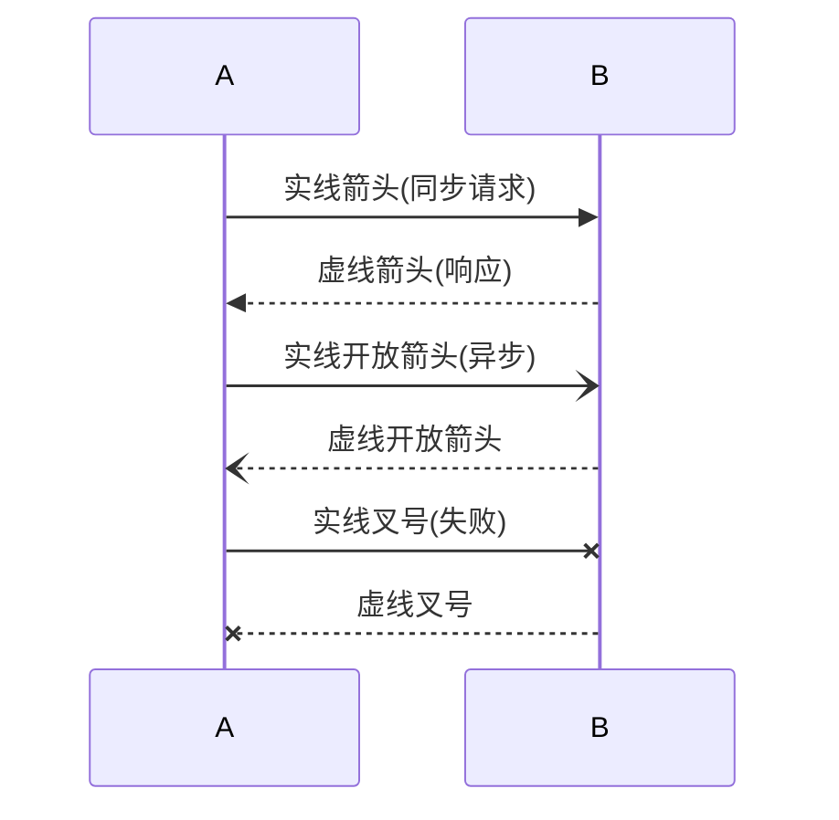
```mermaid
sequenceDiagram
    A->>B: 实线箭头(同步请求)
    B-->>A: 虚线箭头(响应)
    A-)B: 实线开放箭头(异步)
    B--)A: 虚线开放箭头
    A-xB: 实线叉号(失败)
    B--xA: 虚线叉号
```

### 箭头速查表

| 语法 | 说明 | 常见用途 |
|------|------|----------|
| `->>` | 实线箭头 | 同步请求 |
| `-->>` | 虚线箭头 | 响应/返回 |
| `-)` | 实线开放箭头 | 异步消息 |
| `--)` | 虚线开放箭头 | 异步响应 |
| `-x` | 实线叉号 | 失败/错误 |
| `--x` | 虚线叉号 | 失败响应 |
| `<<->>` | 双向实线箭头 | 双向通信 |
| `<<-->>` | 双向虚线箭头 | 双向响应 |

---

## 激活态 Activation

### 显式激活

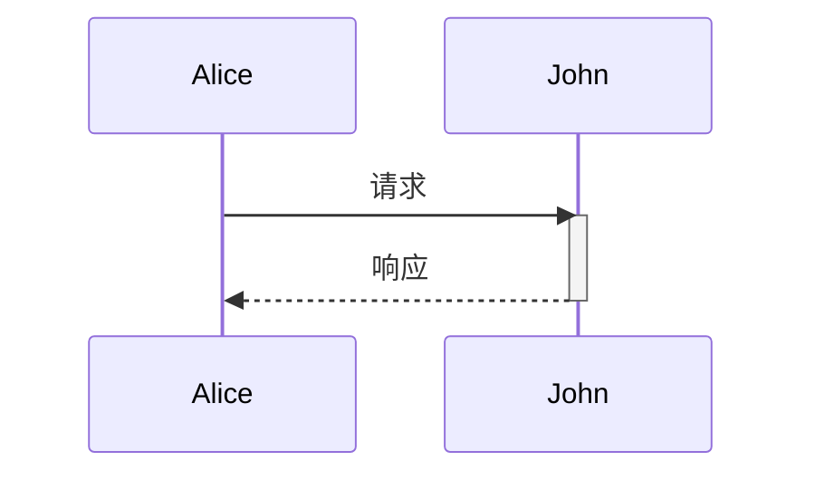
```mermaid
sequenceDiagram
    Alice->>John: 请求
    activate John
    John-->>Alice: 响应
    deactivate John
```

### 简写激活 (推荐)


```mermaid
sequenceDiagram
    Alice->>+John: 请求
    John-->>-Alice: 响应
```

### 嵌套激活

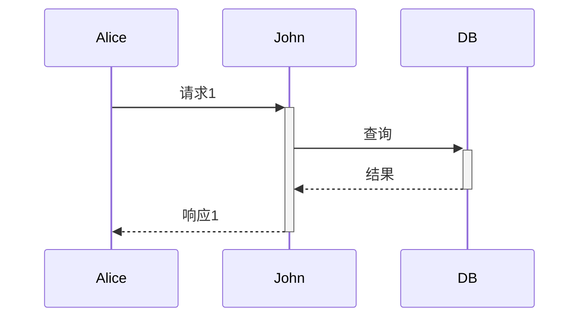
```mermaid
sequenceDiagram
    Alice->>+John: 请求1
    John->>+DB: 查询
    DB-->>-John: 结果
    John-->>-Alice: 响应1
```

---

## Note 注释 ⭐

### Note 位置

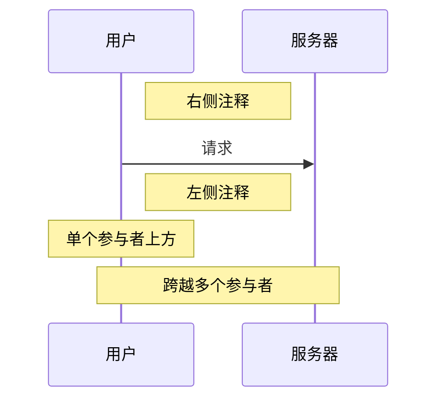
```mermaid
sequenceDiagram
    participant A as 用户
    participant B as 服务器
    
    Note right of A: 右侧注释
    A->>B: 请求
    Note left of B: 左侧注释
    Note over A: 单个参与者上方
    Note over A,B: 跨越多个参与者
```

### Note 语法

```text
Note right of 参与者: 注释内容
Note left of 参与者: 注释内容
Note over 参与者: 注释内容
Note over 参与者1,参与者2: 跨越多个参与者的注释
```

### 多行 Note

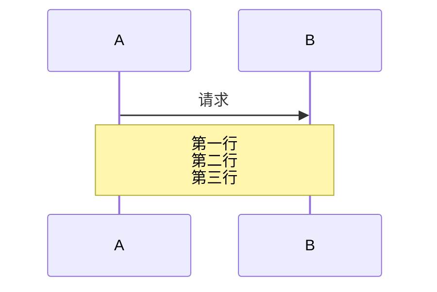
```mermaid
sequenceDiagram
    A->>B: 请求
    Note over A,B: 第一行<br/>第二行<br/>第三行
```

---

## 背景高亮 rect ⭐

### RGB 颜色

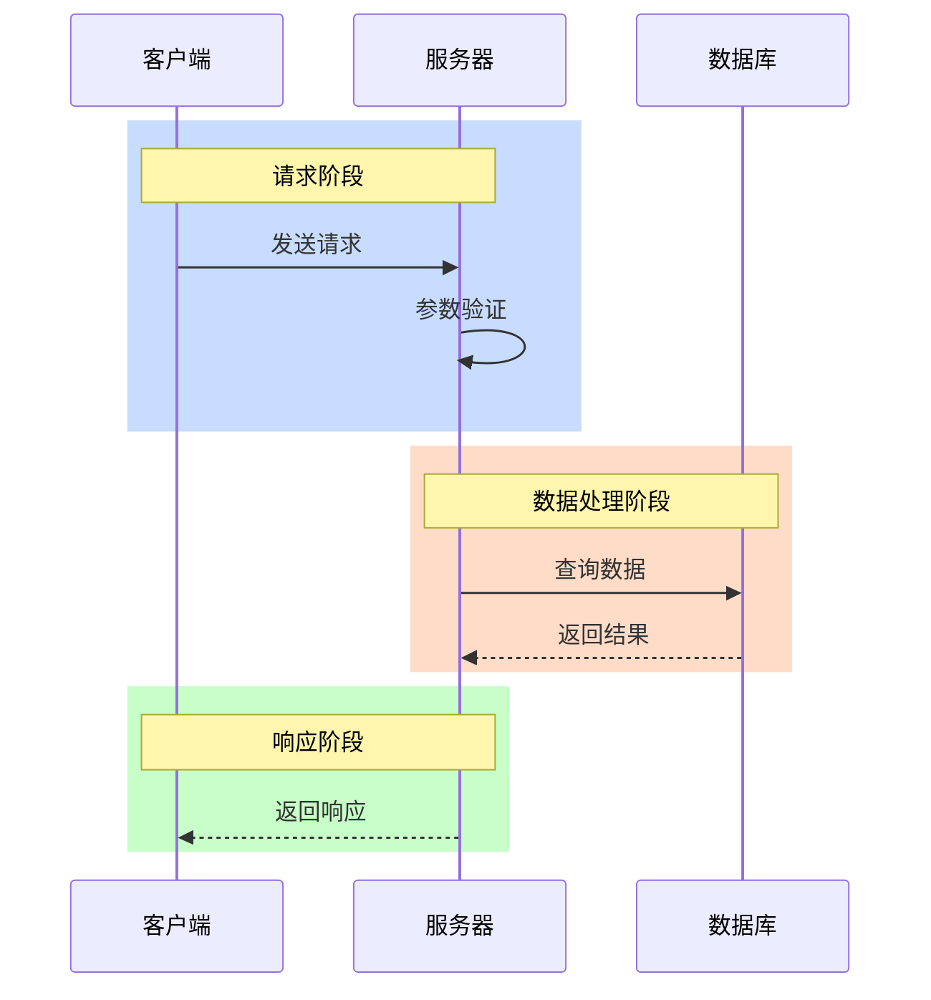
```mermaid
sequenceDiagram
    participant A as 客户端
    participant B as 服务器
    participant C as 数据库
    
    rect rgb(200, 220, 255)
        Note over A,B: 请求阶段
        A->>B: 发送请求
        B->>B: 参数验证
    end
    
    rect rgb(255, 220, 200)
        Note over B,C: 数据处理阶段
        B->>C: 查询数据
        C-->>B: 返回结果
    end
    
    rect rgb(200, 255, 200)
        Note over A,B: 响应阶段
        B-->>A: 返回响应
    end
```

### RGBA 透明色

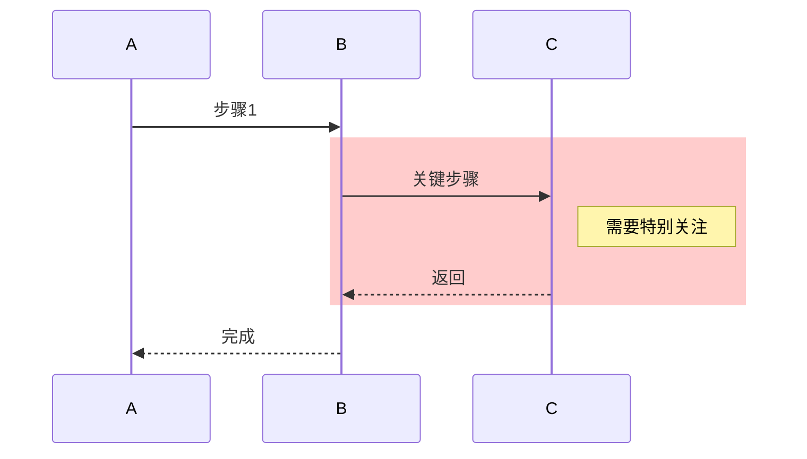
```mermaid
sequenceDiagram
    A->>B: 步骤1
    rect rgba(255, 0, 0, 0.2)
        B->>C: 关键步骤
        Note right of C: 需要特别关注
        C-->>B: 返回
    end
    B-->>A: 完成
```

### rect 语法

```text
rect rgb(红, 绿, 蓝)
    ... 消息 ...
end

rect rgba(红, 绿, 蓝, 透明度)
    ... 消息 ...
end
```

> 透明度范围: 0.0 (完全透明) 到 1.0 (不透明)

---

## 控制流

### 循环 loop

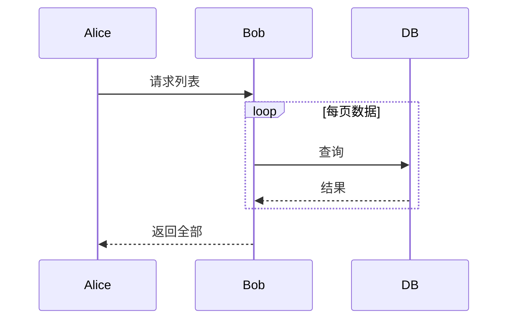
```mermaid
sequenceDiagram
    Alice->>Bob: 请求列表
    loop 每页数据
        Bob->>DB: 查询
        DB-->>Bob: 结果
    end
    Bob-->>Alice: 返回全部
```

### 条件 alt/else

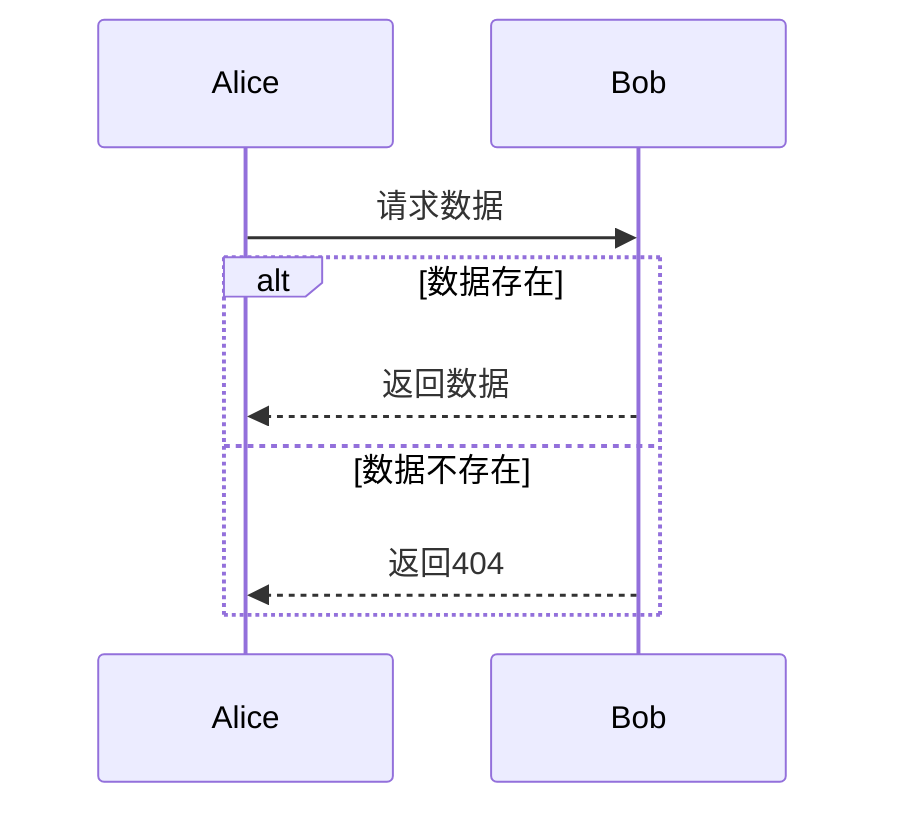
```mermaid
sequenceDiagram
    Alice->>Bob: 请求数据
    alt 数据存在
        Bob-->>Alice: 返回数据
    else 数据不存在
        Bob-->>Alice: 返回404
    end
```

### 可选 opt

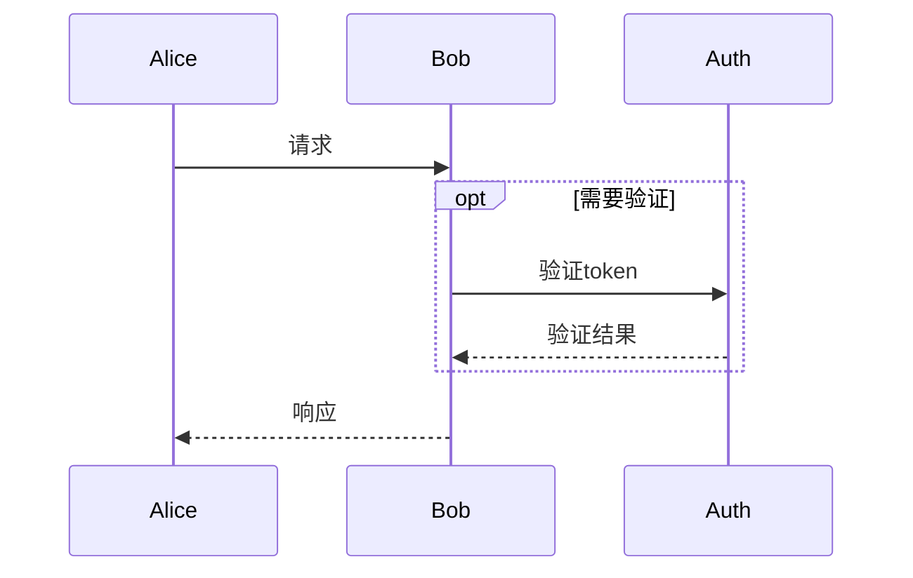
```mermaid
sequenceDiagram
    Alice->>Bob: 请求
    opt 需要验证
        Bob->>Auth: 验证token
        Auth-->>Bob: 验证结果
    end
    Bob-->>Alice: 响应
```

### 并行 par

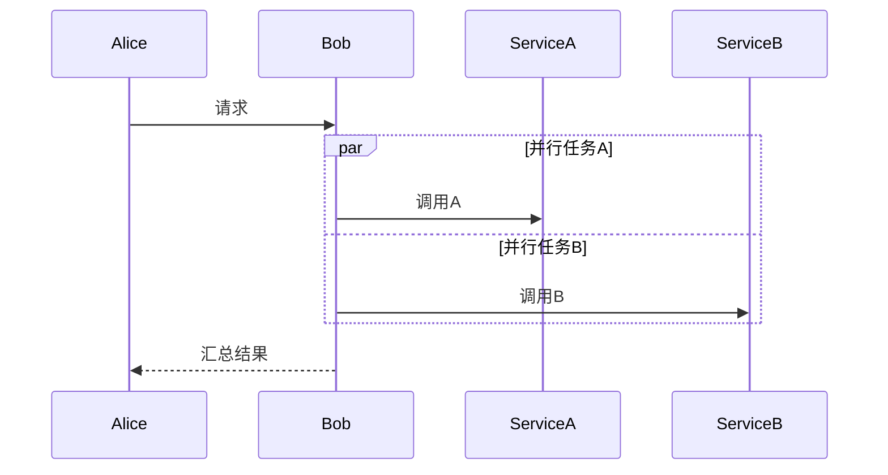
```mermaid
sequenceDiagram
    Alice->>Bob: 请求
    par 并行任务A
        Bob->>ServiceA: 调用A
    and 并行任务B
        Bob->>ServiceB: 调用B
    end
    Bob-->>Alice: 汇总结果
```

### 关键区域 critical

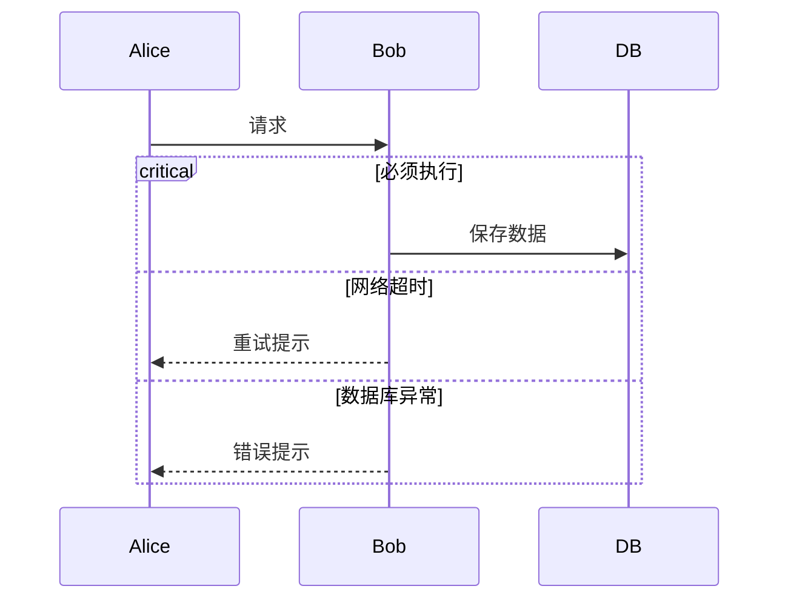
```mermaid
sequenceDiagram
    Alice->>Bob: 请求
    critical 必须执行
        Bob->>DB: 保存数据
    option 网络超时
        Bob-->>Alice: 重试提示
    option 数据库异常
        Bob-->>Alice: 错误提示
    end
```

### 中断 break

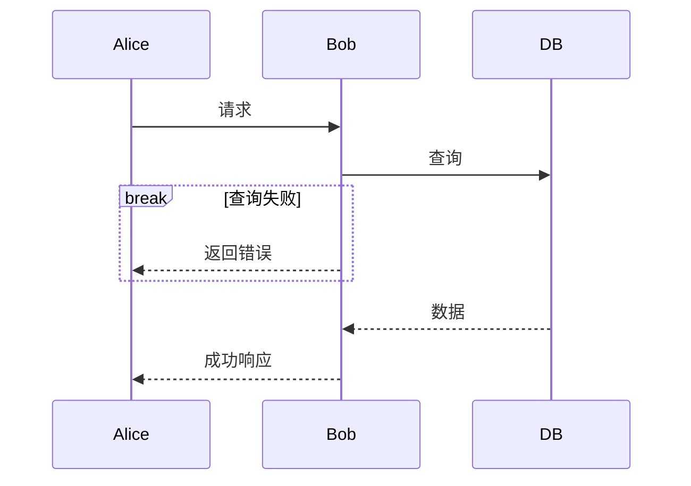
```mermaid
sequenceDiagram
    Alice->>Bob: 请求
    Bob->>DB: 查询
    break 查询失败
        Bob-->>Alice: 返回错误
    end
    DB-->>Bob: 数据
    Bob-->>Alice: 成功响应
```

---

## 参与者分组 Box

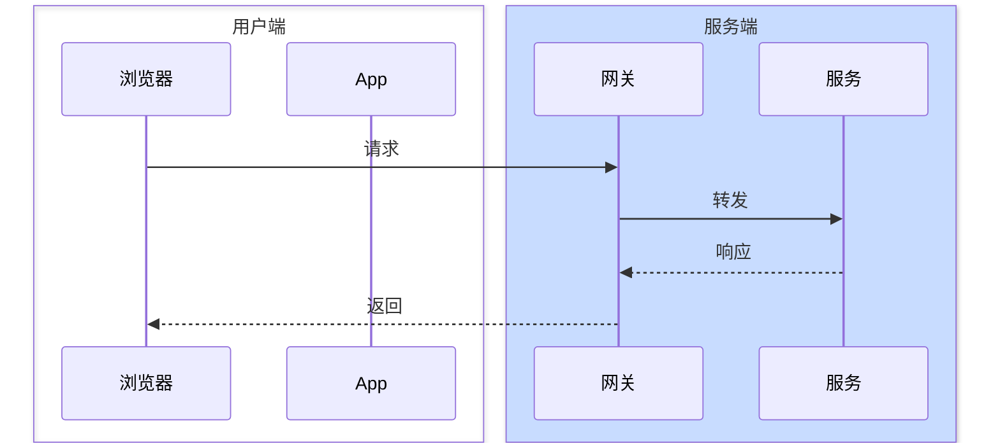
```mermaid
sequenceDiagram
    box 用户端
        participant A as 浏览器
        participant B as App
    end
    box rgb(200,220,255) 服务端
        participant C as 网关
        participant D as 服务
    end
    
    A->>C: 请求
    C->>D: 转发
    D-->>C: 响应
    C-->>A: 返回
```

### Box 语法

```text
box 颜色 描述
    participant 参与者1
    participant 参与者2
end
```

---

## 序号显示

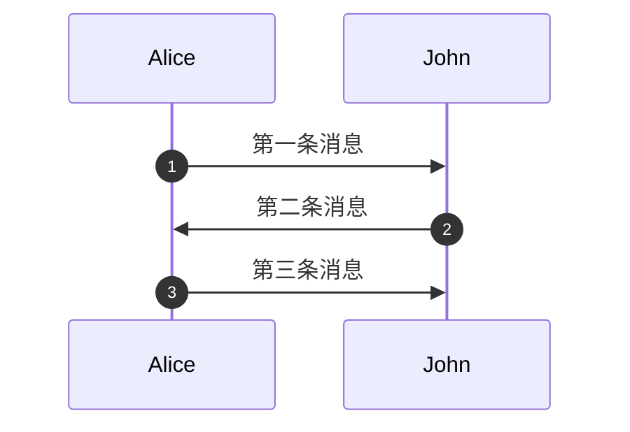
```mermaid
sequenceDiagram
    autonumber
    Alice->>John: 第一条消息
    John->>Alice: 第二条消息
    Alice->>John: 第三条消息
```

---

## 完整示例

### 用户登录流程

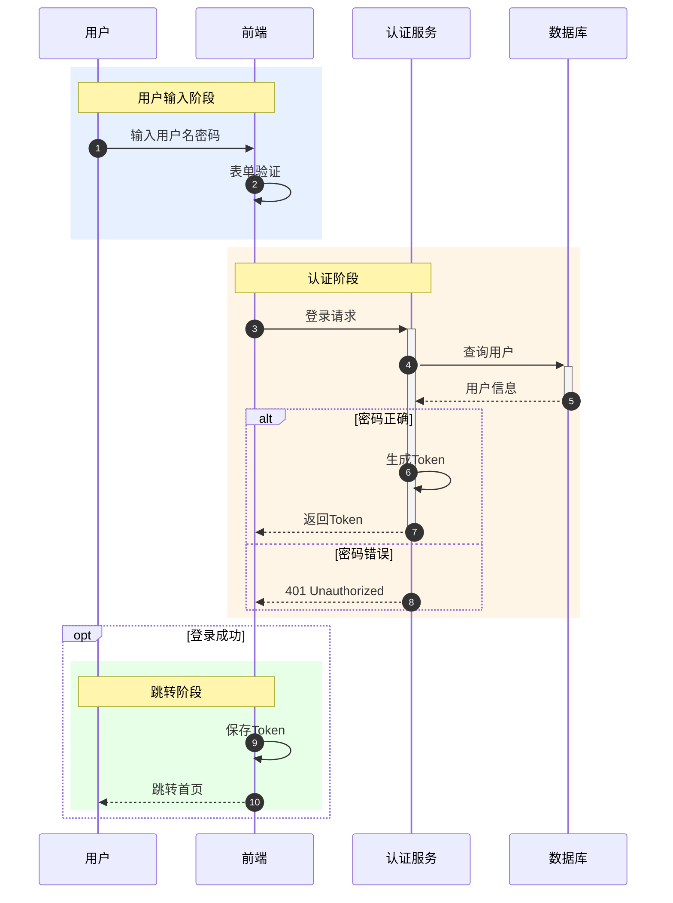
```mermaid
sequenceDiagram
    autonumber
    participant U as 用户
    participant F as 前端
    participant A as 认证服务
    participant D as 数据库
    
    rect rgb(230, 240, 255)
        Note over U,F: 用户输入阶段
        U->>F: 输入用户名密码
        F->>F: 表单验证
    end
    
    rect rgb(255, 245, 230)
        Note over F,A: 认证阶段
        F->>+A: 登录请求
        A->>+D: 查询用户
        D-->>-A: 用户信息
        
        alt 密码正确
            A->>A: 生成Token
            A-->>-F: 返回Token
        else 密码错误
            A-->>F: 401 Unauthorized
        end
    end
    
    opt 登录成功
        rect rgb(230, 255, 230)
            Note over U,F: 跳转阶段
            F->>F: 保存Token
            F-->>U: 跳转首页
        end
    end
```

---

## 常见错误

1. **参与者名中不能有特殊字符**: 使用别名
   ```text
   ✅ participant A as 用户(Admin)
   ❌ participant 用户(Admin)
   ```

2. **rect 必须有 end**: 每个 rect 块必须以 end 结束

3. **Note 位置关键字**: 只能用 `right of`, `left of`, `over`

4. **箭头方向**: `->>` 是发送，`-->>` 是响应，方向由参与者位置决定

5. **激活态配对**: `+` 和 `-` 必须配对使用
