# ZenUML 时序图

## 概述

| 属性 | 值 |
|------|-----|
| **关键字** | `zenuml` |
| **用途** | 时序图的替代语法，更接近编程风格 |
| **Note 支持** | ✅ `// comment` 行注释 |
| **颜色支持** | ❌ 有限 |

---

## 基础语法

### 声明方式

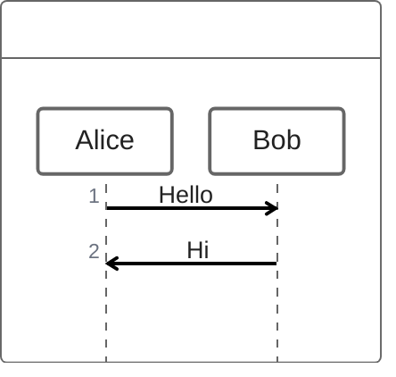

**特点**: 使用更接近编程语言的语法

---

## 参与者

### 隐式声明

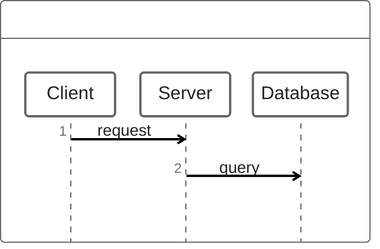

### 显式声明

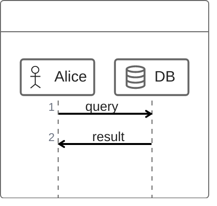

### 参与者注解

| 注解 | 说明 |
|------|------|
| `@Actor` | 人物角色 |
| `@Boundary` | 边界 |
| `@Control` | 控制器 |
| `@Entity` | 实体 |
| `@Database` | 数据库 |
| `@Collection` | 集合 |
| `@Queue` | 队列 |

### 别名

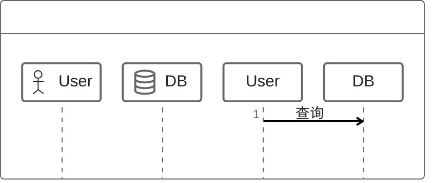

---

## 消息类型

### 同步消息

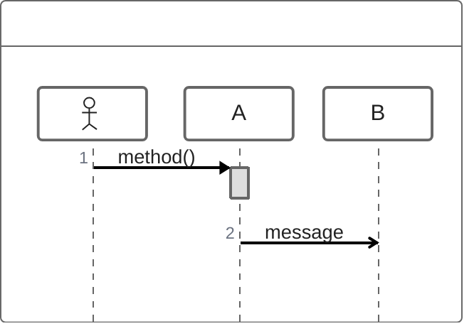

### 异步消息

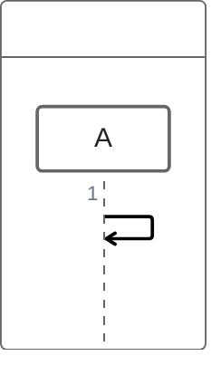

### 返回消息

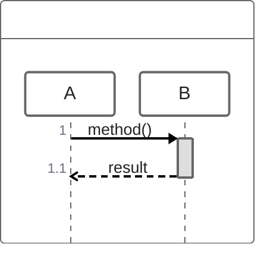

---

## 方法调用风格

### 函数调用

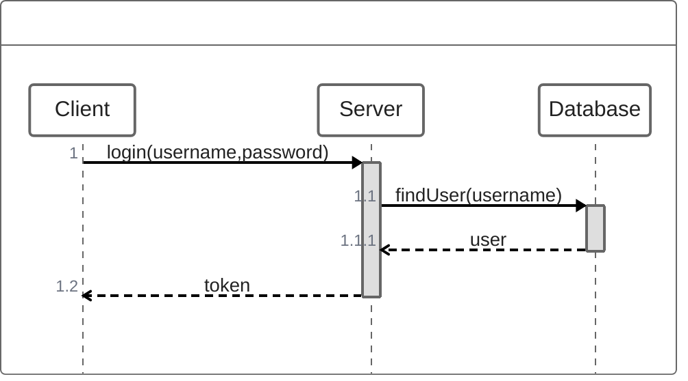

### 嵌套调用

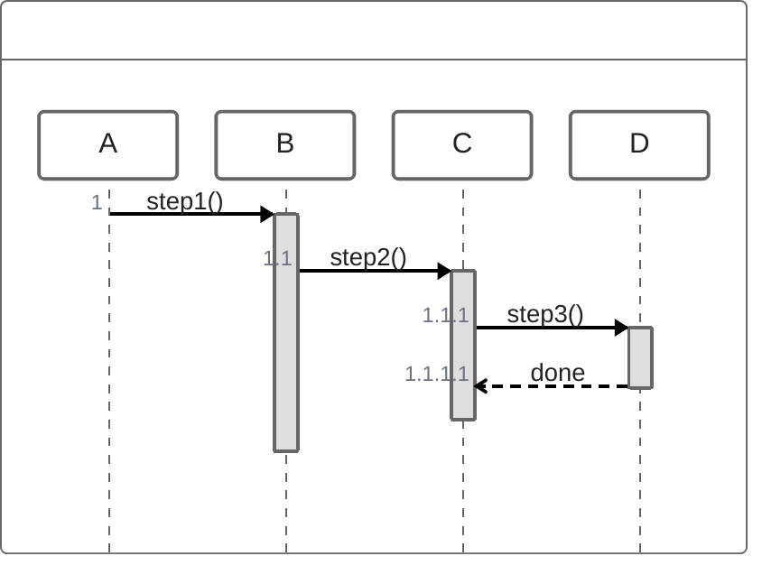

---

## 注释 ⭐

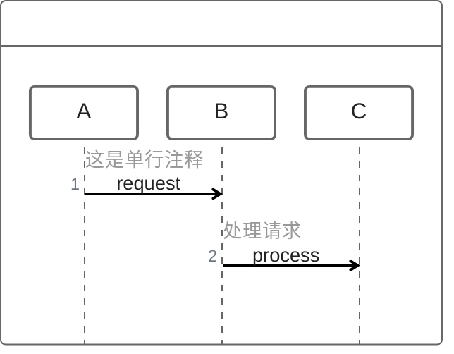

---

## 控制流

### 循环 loop/while/for

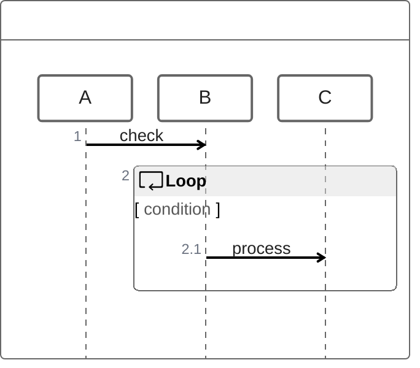

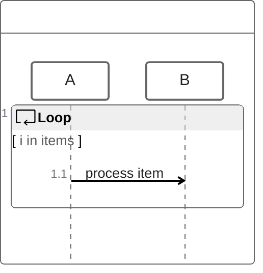

### 条件 if/else

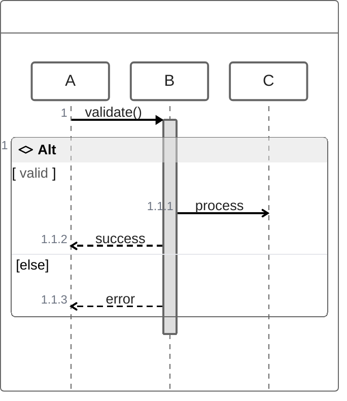

### try/catch/finally

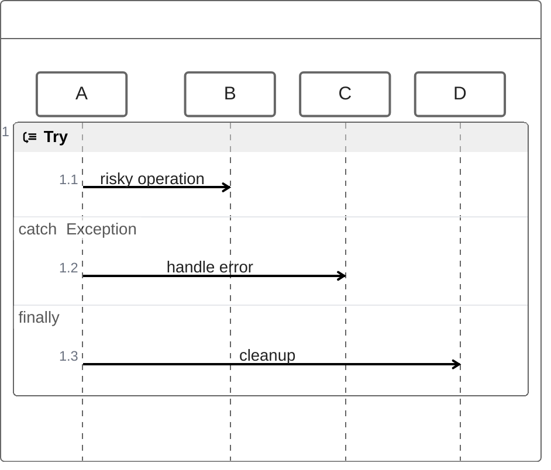

### 可选 opt

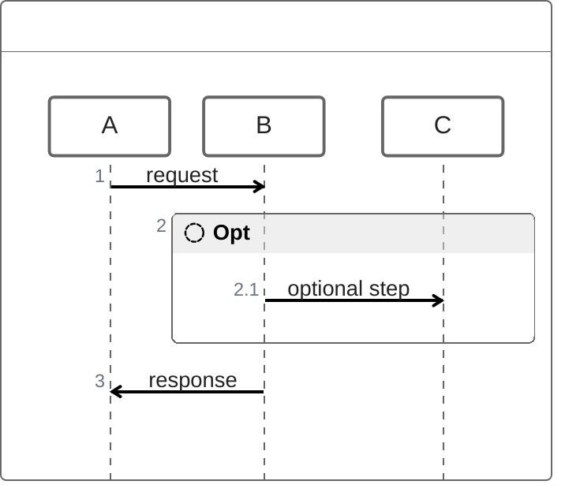

### 并行 par

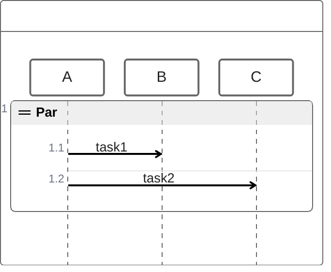

---

## 完整示例

### 用户登录流程

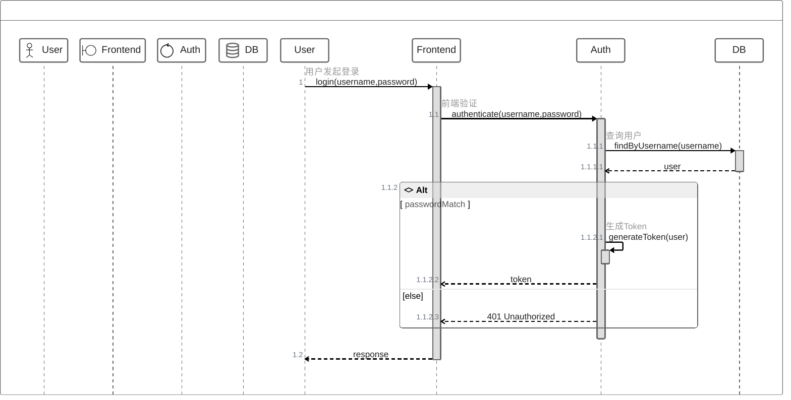

### 订单处理

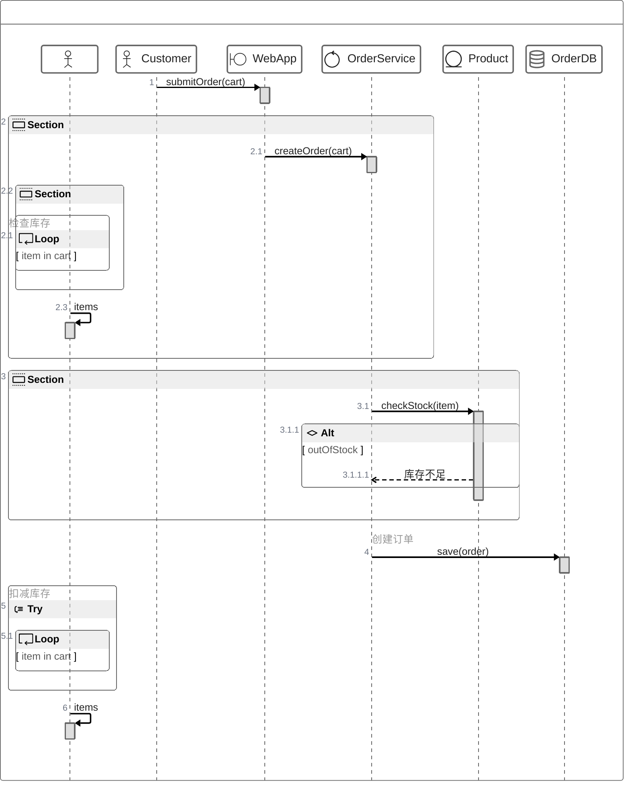

### API调用

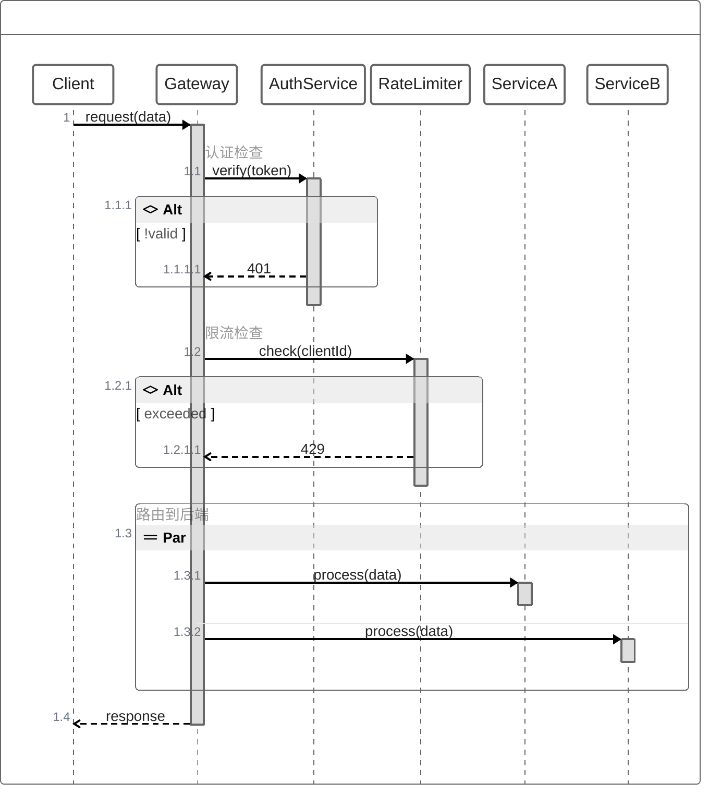

---

## 与 sequenceDiagram 对比

| 特性 | sequenceDiagram | zenuml |
|------|-----------------|--------|
| 语法风格 | 声明式 | 编程式 |
| 函数调用 | 不支持 | ✅ 支持 |
| 嵌套结构 | alt/else/end | if/else + {} |
| 循环 | loop...end | while/for + {} |
| 颜色高亮 | rect rgb() | ❌ 有限 |
| Note | Note over/right/left | // 注释 |

---

## 常见错误

1. **使用大括号嵌套**: 不是 `end`
   ```text
   ✅ if(condition) { ... }
   ❌ if(condition) ... end
   ```

2. **返回值语法**:
   ```text
   ✅ return result
   ❌ -->> result
   ```

3. **注解格式**: 使用 `@`
   ```text
   ✅ @Actor User
   ❌ actor User
   ```

4. **方法调用**: 使用点号
   ```text
   ✅ A->B.method()
   ✅ A.method()
   ```

5. **别名**: 使用 `as`
   ```text
   ✅ @Actor "用户" as User
   ```
